This section explores Arch's consensus mechanism, which combines ROAST (Robust Asynchronous Schnorr Threshold Signatures) and FROST (Flexible Round-Optimized Schnorr Threshold Signatures) to create a secure, efficient, and highly scalable approach to distributed consensus that's perfectly suited for Bitcoin-based smart contracts.

## Implementation Status

The consensus mechanism implementation has made significant progress, particularly in the core cryptographic components:

1. **Implemented Components**
   - Complete Distributed Key Generation (DKG) protocol using FROST-secp256k1
   - Two-round DKG process with package handling
   - Network message protocol for DKG coordination
   - State management and status tracking
   - Integration with network layer
   - Error handling and recovery mechanisms

2. **In Progress**
   - Additional ROAST protocol components
   - Advanced state management features
   - Performance optimizations
   - Extended monitoring and telemetry

The subsequent sections describe both the implemented features and the complete protocol design.

## Core Implementation Details

### Distributed Key Generation (DKG)

```rust
// Core DKG message types for network coordination
pub enum DKGMessage {
    StartDKG { message: String },
    Round1Package { package: round1::Package },
    Round2Package { package: round2::Package },
    DKGStatus(DKGStatusMessage),
}

// DKG state management
pub enum DKGStatus {
    Pending(String),
    Ongoing(String),
    Failed(String, String),
    Finished(String),
    NetworkCompleted(String),
}
```

The DKG implementation provides:
- Two-round key generation protocol
- Secure package exchange between validators
- State tracking and synchronization
- Failure recovery and error handling

## Distributed Key Generation (DKG) Deep Dive

### What is DKG?

Distributed Key Generation (DKG) is the cryptographic process that allows a group of validators to collectively generate a master key pair without any single validator knowing the complete private key. This is the foundation of Arch's threshold signature scheme.

### Why DKG is Critical

In Arch's consensus model:
- **No single point of failure**: No validator can sign alone
- **Threshold security**: Only a subset of validators (e.g., 2-of-3) need to cooperate
- **Distributed trust**: The network's security doesn't depend on any single party
- **Bitcoin compatibility**: Uses the same secp256k1 curve as Bitcoin

### The DKG Process Flow

#### Phase 1: Network Initialization
1. **Validator Startup**: Each validator starts in `WaitingForDkg` state
2. **Peer Discovery**: Validators connect to each other and the bootnode
3. **Whitelist Verification**: All validators in the whitelist must be online
4. **Leader Initiation**: The designated leader triggers DKG when all peers are ready

#### Phase 2: Round 1 - Commitment Generation

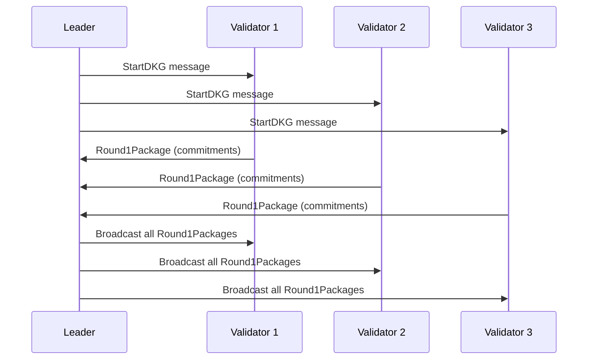

Each validator:
- Generates a random secret share
- Creates polynomial commitments
- Broadcasts Round1 packages to all peers
- Waits for Round1 packages from all other validators

#### Phase 3: Round 2 - Key Generation

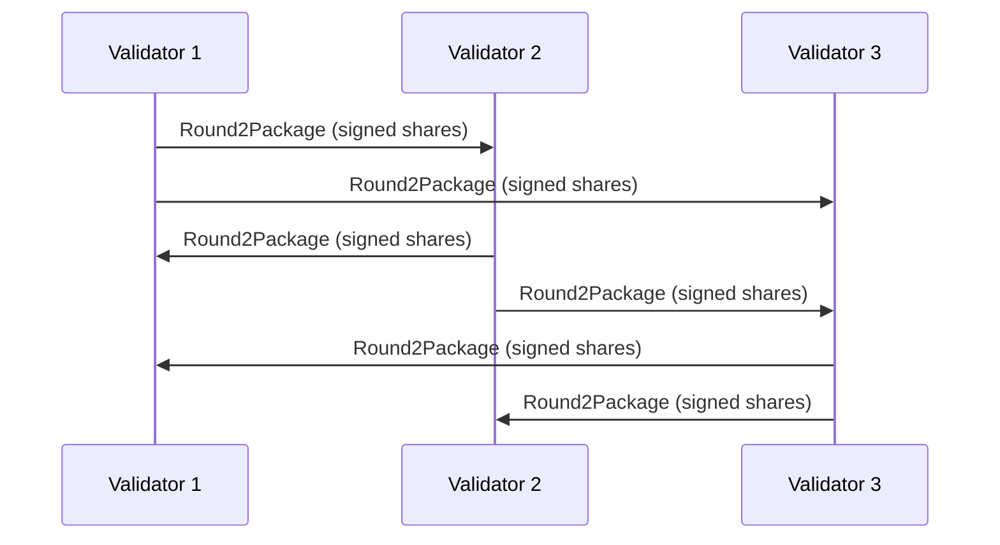

Each validator:
- Receives Round1 packages from all peers
- Computes their contribution to the final key
- Generates Round2 packages with signed shares
- Exchanges Round2 packages with all peers

#### Phase 4: Finalization

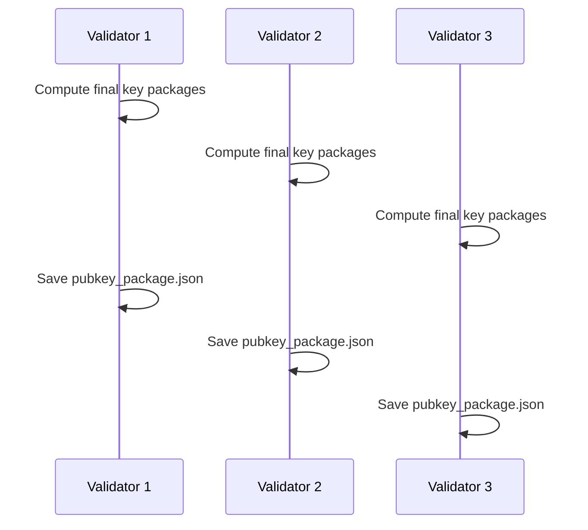

Each validator:
- Combines all Round2 packages
- Computes the final `PublicKeyPackage`
- Saves the `pubkey_package.json` file
- Transitions to `Ready` state

### The `pubkey_package.json` File

#### Location and Structure
The `pubkey_package.json` file is automatically created in:
```text
{data_dir}/{network_mode}/pubkey_package.json
```

For example: `./.arch_data/devnet/pubkey_package.json`

#### File Format
```json
{
  "verifying_key": {
    "element": "02a0434d9e47f3c86235477c7b1ae6ae5d3442d49b1943c2b752a68e2a47e247c7"
  },
  "verifying_shares": {
    "0000000000000000000000000000000000000000000000000000000000000001": {
      "element": "02b8d9aa7c3d4e5f6a7b8c9d0e1f2a3b4c5d6e7f8a9b0c1d2e3f4a5b6c7d8e9f0"
    },
    "0000000000000000000000000000000000000000000000000000000000000002": {
      "element": "03c9eabb8d4e5f6a7b8c9d0e1f2a3b4c5d6e7f8a9b0c1d2e3f4a5b6c7d8e9f0a1"
    }
  }
}
```

#### What Each Field Represents
- **`verifying_key`**: The master public key for the entire validator set
- **`verifying_shares`**: Individual public keys for each validator's share
- **`element` fields**: secp256k1 curve points in compressed format

### Key Security Properties

#### Threshold Signing
- **2-of-3 example**: With 3 validators, only 2 need to cooperate to sign
- **No single point of failure**: No validator can sign alone
- **Flexible thresholds**: Can be configured for different security levels

#### Cryptographic Guarantees
- **Information theoretic security**: Based on proven cryptographic principles
- **Forward secrecy**: Compromised shares don't reveal past signatures
- **Verifiable**: All participants can verify the correctness of the process

## Block Production Process

### 1. Leader Selection

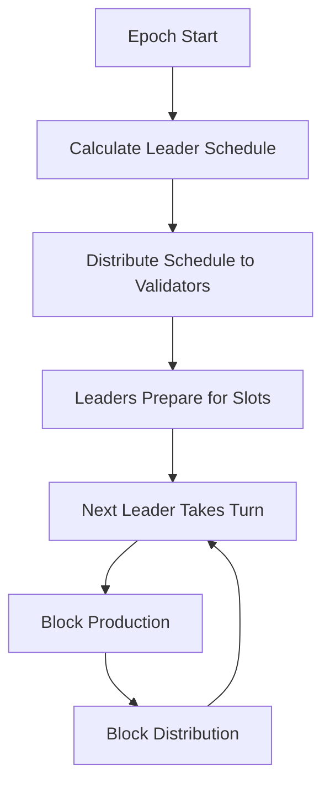

The block production process begins with leader selection:
- Each epoch (fixed time period) has a predetermined leader schedule
- Leaders are selected based on their stake weight
- The schedule is deterministic and known to all validators
- Multiple backup leaders are selected for fault tolerance

### 2. Transaction Collection and Verification

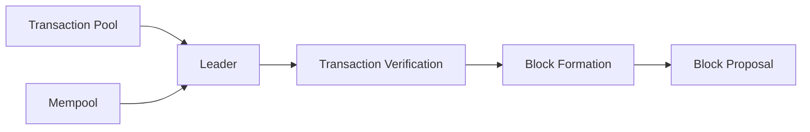

When a validator becomes the leader:
1. Collects pending transactions from the mempool
2. Verifies transaction signatures and validity
3. Orders transactions based on priority and fees
4. Prepares them for inclusion in the next block

### 3. Block Formation

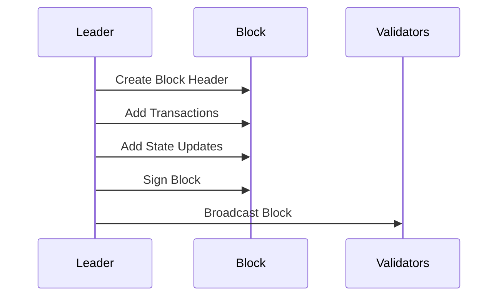

The block structure includes:
- Previous block reference
- Timestamp
- Transaction merkle root
- UTXO state updates
- Leader's signature

## Consensus Process

### 1. Block Validation

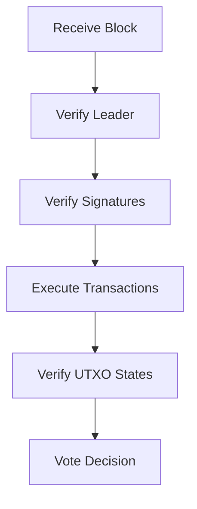

When validators receive a new block:
1. Verify the block producer is the designated leader
2. Validate all transaction signatures
3. Execute transactions and verify UTXO states
4. Check for any consensus rule violations

### 2. UTXO-Based State Management

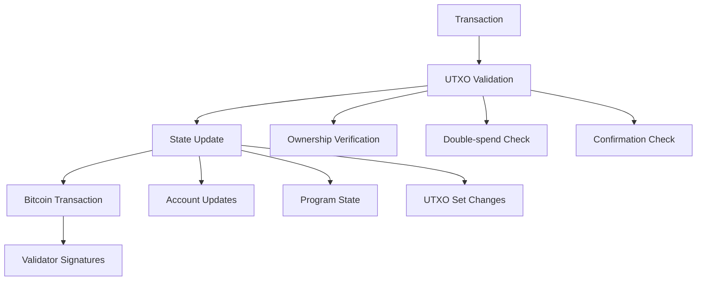

Arch's unique approach to state management leverages Bitcoin's UTXO model while extending it for smart contract functionality:

#### UTXO State Tracking

```rust
pub struct UtxoState {
    pub meta: UtxoMeta,          // UTXO identification
    pub status: UtxoStatus,      // Current UTXO status
    pub owner: Pubkey,           // UTXO owner
    pub created_at: i64,         // Creation timestamp
    pub spent_at: Option<i64>,   // Spend timestamp if spent
}

pub enum UtxoStatus {
    Pending,    // Waiting for confirmations
    Active,     // Confirmed and spendable
    Spent,      // UTXO has been consumed
    Invalid,    // UTXO was invalidated (e.g., by reorg)
}
```

#### State Transition Process
1. **UTXO Validation**
   - Verify UTXO existence on Bitcoin
   - Check confirmation requirements (typically 6+)
   - Validate ownership and spending conditions
   - Prevent double-spending attempts

2. **State Updates**
   - Atomic account data modifications
   - Program state transitions
   - UTXO set updates
   - Cross-validator state consistency

3. **Bitcoin Integration**
   - State anchoring to Bitcoin transactions
   - Threshold signature aggregation
   - Transaction finality through Bitcoin confirmations
   - Reorg handling and state rollbacks

### 3. FROST Signing Process

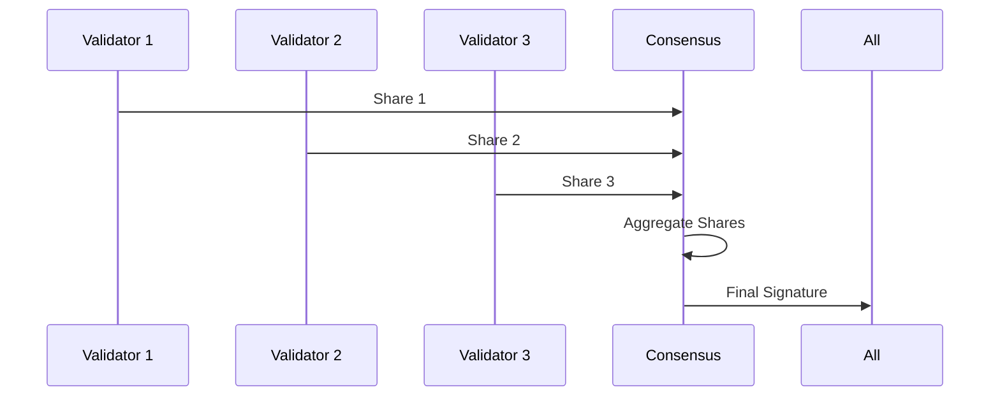

The FROST signing process involves:
1. Each validator generates their partial signature
2. Signatures are shared among the threshold group
3. Partial signatures are aggregated into a final signature
4. The aggregated signature is verified against the group public key

### 4. ROAST Enhancement Layer

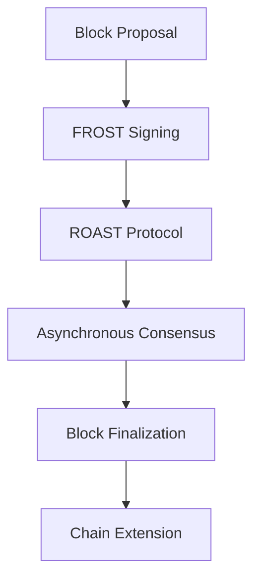

ROAST transforms FROST into a production-ready consensus mechanism by adding several crucial enhancements:

#### Asynchronous Operation Guarantees

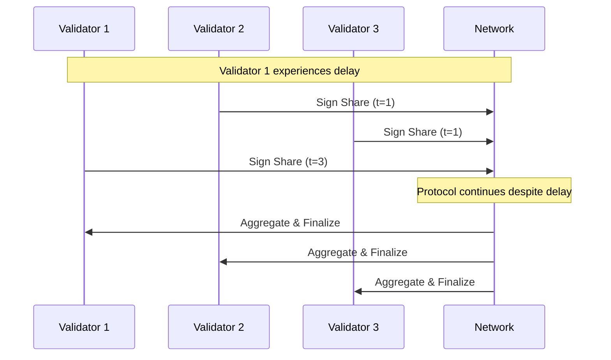

Unlike traditional consensus mechanisms that require strict synchronization:
- Validators can participate in signing rounds without tight timing constraints
- The protocol progresses even when some validators are temporarily delayed
- Network partitions and varying message delivery times are handled gracefully
- No assumptions about network synchrony are required for safety

#### Byzantine Fault Tolerance

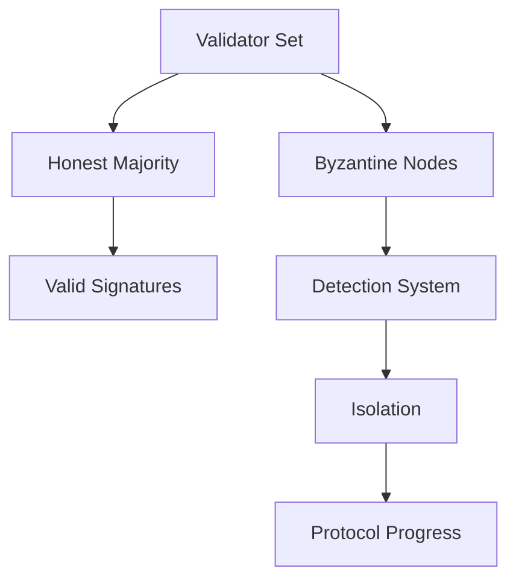

ROAST maintains safety and liveness even in the presence of malicious actors:
- Tolerates up to f Byzantine validators where f < n/3
- Malicious behavior is detected and isolated
- Signature shares from Byzantine validators can be identified and excluded
- The protocol remains secure even if Byzantine validators:
  * Submit invalid signature shares
  * Attempt to sign conflicting blocks
  * Try to delay or prevent consensus
  * Collude with other malicious validators

## Understanding FROST

FROST is a threshold signature scheme that enables a group of participants to collectively generate Schnorr signatures. This foundational protocol is crucial for Arch's consensus mechanism because it provides a way to achieve distributed agreement while maintaining compatibility with Bitcoin's native signature scheme.

### Key Components

- **Distributed Key Generation**: Validators collectively participate in a process that generates a shared public key while keeping individual private key shares separate and secure.
- **Threshold Signatures**: The system requires a specific number of validators (t-of-n) to cooperate in order to produce valid signatures, balancing security with fault tolerance.
- **Share Management**: Each validator maintains their own private key share, contributing to the system's security through distribution of trust.
- **Signature Aggregation**: Multiple partial signatures are combined into a single Schnorr signature that's indistinguishable from a standard single-signer signature.

### Benefits of FROST

1. **Enhanced Security**
   - No single validator can compromise the system
   - Distributed trust model eliminates single points of failure
   - Cryptographic guarantees of signature validity

2. **Bitcoin Compatibility**
   - Native integration with Bitcoin's Schnorr signature scheme
   - No additional on-chain overhead
   - Seamless interaction with Bitcoin's transaction validation

3. **Efficiency**
   - Constant-size signatures regardless of validator count
   - Optimized communication patterns
   - Reduced blockchain space usage

## ROAST: Enhancing FROST for Production

While FROST provides the cryptographic foundation, ROAST adds crucial properties needed for real-world deployment in adversarial environments. ROAST transforms FROST from a theoretical protocol into a production-ready consensus mechanism.

### Key Enhancements

1. **Asynchronous Operation**
   - Validators can participate without strict timing requirements
   - Resilient to network delays and partitions
   - Maintains liveness in real-world conditions

2. **Robustness Against Attacks**
   - Continues operating even with malicious participants
   - Detects and handles various forms of validator misbehavior
   - Provides provable security guarantees

3. **Leader Selection**
   - Efficient and fair leader rotation mechanism
   - Prevents centralization of power
   - Maintains system progress even if leaders fail

4. **Liveness Guarantees**
   - Ensures forward progress under adverse conditions
   - Handles validator churn gracefully
   - Recovers automatically from temporary failures

## Security Considerations

### Threat Model

- **Byzantine Validators**: System remains secure with up to f Byzantine validators (where f < n/3)
- **Network Adversaries**: Resilient against various network-level attacks
- **Cryptographic Security**: Based on well-studied cryptographic assumptions

### Security Properties

1. **Safety**
   - No conflicting transactions can be confirmed
   - Cryptographic guarantees of transaction finality
   - Protection against double-spending

2. **Liveness**
   - System continues to make progress
   - Recovers from temporary failures
   - Handles validator set changes

3. **Fault Tolerance**
   - Continues operating with partial validator failures
   - Graceful degradation under attack
   - Automatic recovery mechanisms

## Further Reading

### Academic Papers and Research

#### FROST (Flexible Round-Optimized Schnorr Threshold Signatures)
- [FROST: Flexible Round-Optimized Schnorr Threshold Signatures](https://eprint.iacr.org/2020/852.pdf) - The original FROST paper by Chelsea Komlo and Ian Goldberg
- [Two-Round Threshold Schnorr Signatures with FROST](https://eprint.iacr.org/2021/1110.pdf) - An optimized two-round variant of FROST
- [Implementing FROST](https://github.com/ZcashFoundation/frost) - Reference implementation by the Zcash Foundation

#### ROAST (Robust Asynchronous Schnorr Threshold Signatures)
- [ROAST: Robust Asynchronous Schnorr Threshold Signatures](https://eprint.iacr.org/2022/550.pdf) - The foundational ROAST paper
- [Practical Threshold Signatures for Bitcoin](https://medium.com/blockstream/implementing-threshold-signatures-for-bitcoin-8d3b63831325) - Implementation insights for Bitcoin-based threshold signatures

#### Threshold Cryptography and Consensus
- [A Survey of Distributed Consensus Protocols for Blockchain Networks](https://arxiv.org/pdf/1904.04098.pdf) - Comprehensive overview of consensus mechanisms
- [Threshold Signatures: The Future of Consensus?](https://eprint.iacr.org/2019/1157.pdf) - Analysis of threshold signatures in consensus protocols
- [Schnorr Multi-Signatures and Applications](https://eprint.iacr.org/2018/068.pdf) - Foundational work on Schnorr multi-signatures

### Technical Resources

#### Implementation Guides
- [BIP 340: Schnorr Signatures for secp256k1](https://github.com/bitcoin/bips/blob/master/bip-0340.mediawiki) - Bitcoin Improvement Proposal for Schnorr signatures
- [Implementing Threshold Signatures](https://tlu.tarilabs.com/cryptography/threshold-signatures) - Technical guide on threshold signature implementation
- [Multi-Party Computation for Distributed Key Generation](https://github.com/ZcashFoundation/redjubjub) - Reference implementation of distributed key generation

#### Security Analysis
- [Security Analysis of Threshold Signature Schemes](https://eprint.iacr.org/2019/114.pdf) - Comprehensive security analysis
- [Formal Verification of FROST](https://eprint.iacr.org/2021/1559.pdf) - Formal security proofs for FROST
- [Byzantine Fault Tolerance in Distributed Systems](https://arxiv.org/pdf/1908.01738.pdf) - Analysis of BFT in consensus protocols

### Community Resources
- [FROST Working Group](https://frost.zfnd.org) - Community working group on FROST implementation
- [Bitcoin Dev Mailing List](https://lists.linuxfoundation.org/pipermail/bitcoin-dev/) - Discussions on threshold signatures in Bitcoin

## Conclusion

The combination of ROAST and FROST in Arch represents a significant advancement in Bitcoin-based smart contract platforms. This consensus mechanism enables sophisticated applications while maintaining the security and decentralization principles that make Bitcoin valuable. Through careful design and implementation, Arch has created a system that is not just theoretically sound but practically deployable and scalable for real-world applications.
