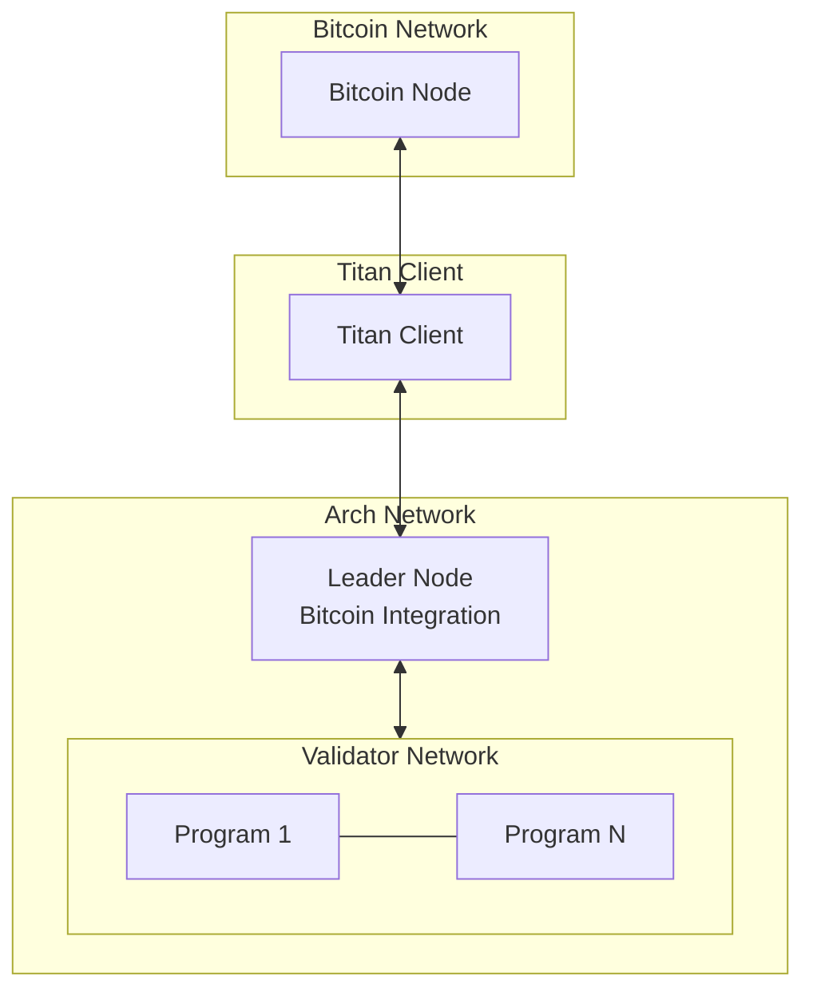
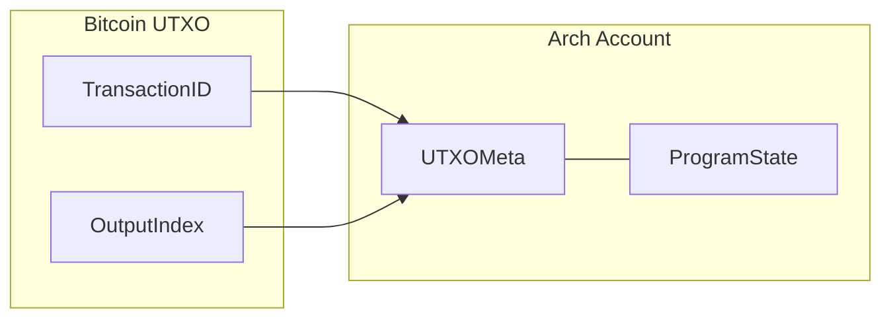
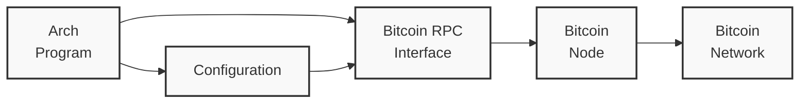
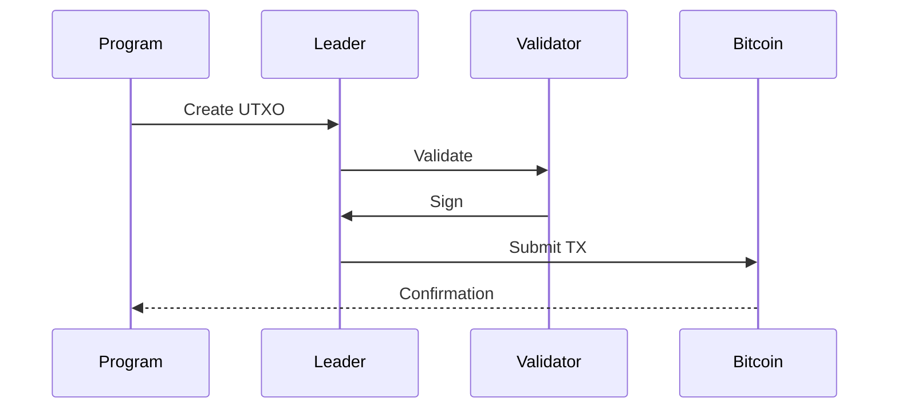

Arch Network provides direct integration with Bitcoin, enabling programs to interact with Bitcoin's UTXO model while maintaining Bitcoin's security guarantees. This document details how Arch Network integrates with Bitcoin.

## Architecture Overview



**Diagram components**

- **Bitcoin Network (Bitcoin Node)**: Canonical source of blocks, transactions, and UTXOs; all confirmations and proofs ultimately derive from it.
- **Titan Client**: Bridges the Bitcoin node and Arch leader by streaming headers, transactions, and UTXO proofs so the leader maintains an up‑to‑date Bitcoin view.
- **Leader Node (Bitcoin Integration)**: Orchestrates verification and submission of Bitcoin‑related operations, coordinating validation and finalization across the network.
- **Validator Network (Programs)**: Executes programs and participates in consensus; validators verify state transitions and provide threshold signatures for Bitcoin‑anchored actions.

## Core Components

### 1. UTXO Management

Arch Network manages Bitcoin UTXOs through a specialized system:



**Diagram components**

- **TransactionID & OutputIndex**: Together identify a specific Bitcoin UTXO; they select the exact output being referenced.
- **UtxoMeta**: Arch‑side record of the UTXO (txid, vout, amount, script, confirmations) used for ownership, spend checks, and proof verification.
- **ProgramState**: Program‑maintained state linked to UTXOs; updates when UTXOs are created or spent to reflect application logic.

```rust
// UTXO Metadata Structure
pub struct UtxoMeta {
    pub txid: [u8; 32],  // Transaction ID
    pub vout: u32,       // Output index
    pub amount: u64,     // Amount in satoshis
    pub script_pubkey: Vec<u8>, // Output script
    pub confirmation_height: Option<u32>, // Block height of confirmation
}

// UTXO Account State
pub struct UtxoAccount {
    pub meta: UtxoMeta,
    pub owner: Pubkey,
    pub delegate: Option<Pubkey>,
    pub state: Vec<u8>,
    pub is_frozen: bool,
}
```

Key operations:

```rust
// UTXO Operations
pub trait UtxoOperations {
    fn create_utxo(meta: UtxoMeta, owner: &Pubkey) -> Result<()>;
    fn spend_utxo(utxo: &UtxoMeta, signature: &Signature) -> Result<()>;
    fn freeze_utxo(utxo: &UtxoMeta, authority: &Pubkey) -> Result<()>;
    fn delegate_utxo(utxo: &UtxoMeta, delegate: &Pubkey) -> Result<()>;
}
```

### 2. Bitcoin RPC Integration



**Diagram components**

- **Arch Program**: Issues reads and submissions related to Bitcoin state and transactions as part of program execution.
- **Bitcoin RPC Interface**: Authenticates and routes requests to the configured Bitcoin node, applying timeouts and network settings from configuration.
- **Bitcoin Node**: Serves chain data and accepts transaction broadcasts; its view anchors program interactions to Bitcoin consensus.
- **Configuration**: Endpoint, credentials, wallet, network, and timeouts that control RPC behavior and security boundaries.
- **Bitcoin Network**: The broader peer‑to‑peer network the node participates in, providing consensus and propagation for transactions and blocks.

Programs can interact with Bitcoin through RPC calls:

```rust
// Bitcoin RPC Configuration
pub struct BitcoinRpcConfig {
    pub endpoint: String,
    pub port: u16,
    pub username: String,
    pub password: String,
    pub wallet: Option<String>,
    pub network: BitcoinNetwork,
    pub timeout: Duration,
}

// RPC Interface
pub trait BitcoinRpc {
    fn get_block_count(&self) -> Result<u64>;
    fn get_block_hash(&self, height: u64) -> Result<BlockHash>;
    fn get_transaction(&self, txid: &Txid) -> Result<Transaction>;
    fn send_raw_transaction(&self, tx: &[u8]) -> Result<Txid>;
    fn verify_utxo(&self, utxo: &UtxoMeta) -> Result<bool>;
}
```

## Transaction Flow



**Diagram components**

- **Program**: Constructs intents and requests UTXO creation or spending based on application logic.
- **Leader**: Validates requests, aggregates threshold signatures, and submits the finalized transaction to Bitcoin.
- **Validator**: Independently verifies inputs/outputs and signs if rules are satisfied, contributing to threshold signing.
- **Bitcoin**: Confirms the transaction on‑chain and provides observable finality that programs can rely on.

### 1. Transaction Creation

```rust
// Create new UTXO transaction
pub struct UtxoCreation {
    pub amount: u64,
    pub owner: Pubkey,
    pub metadata: Option<Vec<u8>>,
}

impl UtxoCreation {
    pub fn new(amount: u64, owner: Pubkey) -> Self {
        Self {
            amount,
            owner,
            metadata: None,
        }
    }

    pub fn with_metadata(mut self, metadata: Vec<u8>) -> Self {
        self.metadata = Some(metadata);
        self
    }
}
```

### 2. Transaction Validation

```rust
// Validation rules
pub trait TransactionValidation {
    fn validate_inputs(&self, tx: &Transaction) -> Result<()>;
    fn validate_outputs(&self, tx: &Transaction) -> Result<()>;
    fn validate_signatures(&self, tx: &Transaction) -> Result<()>;
    fn validate_script(&self, tx: &Transaction) -> Result<()>;
}
```

### 3. State Management

```rust
// State transition
pub struct StateTransition {
    pub previous_state: Hash,
    pub next_state: Hash,
    pub utxos_created: Vec<UtxoMeta>,
    pub utxos_spent: Vec<UtxoMeta>,
    pub bitcoin_height: u64,
}
```

## Security Model

### 1. UTXO Security

- Ownership verification through public key cryptography
- Double-spend prevention through UTXO consumption
- State anchoring to Bitcoin transactions
- Threshold signature requirements

### 2. Transaction Security

```rust
// Transaction security parameters
pub struct SecurityParams {
    pub min_confirmations: u32,
    pub signature_threshold: u32,
    pub timelock_blocks: u32,
    pub max_witness_size: usize,
}
```

### 3. Network Security

- Multi-signature validation
- Threshold signing (t-of-n)
- Bitcoin-based finality
- Cross-validator consistency

## Error Handling

### 1. Bitcoin Errors

```rust
pub enum BitcoinError {
    ConnectionFailed(String),
    InvalidTransaction(String),
    InsufficientFunds(u64),
    InvalidUtxo(UtxoMeta),
    RpcError(String),
}
```

### 2. UTXO Errors

```rust
pub enum UtxoError {
    NotFound(UtxoMeta),
    AlreadySpent(UtxoMeta),
    InvalidOwner(Pubkey),
    InvalidSignature(Signature),
    InvalidState(Hash),
}
```

## Best Practices

### 1. UTXO Management

- Always verify UTXO ownership
- Wait for sufficient confirmations
- Handle reorganizations gracefully
- Implement proper error handling

### 2. Transaction Processing

- Validate all inputs and outputs
- Check signature thresholds
- Maintain proper state transitions
- Monitor Bitcoin network status

### 3. Security Considerations

- Protect private keys
- Validate all signatures
- Monitor for double-spend attempts
- Handle network partitions
