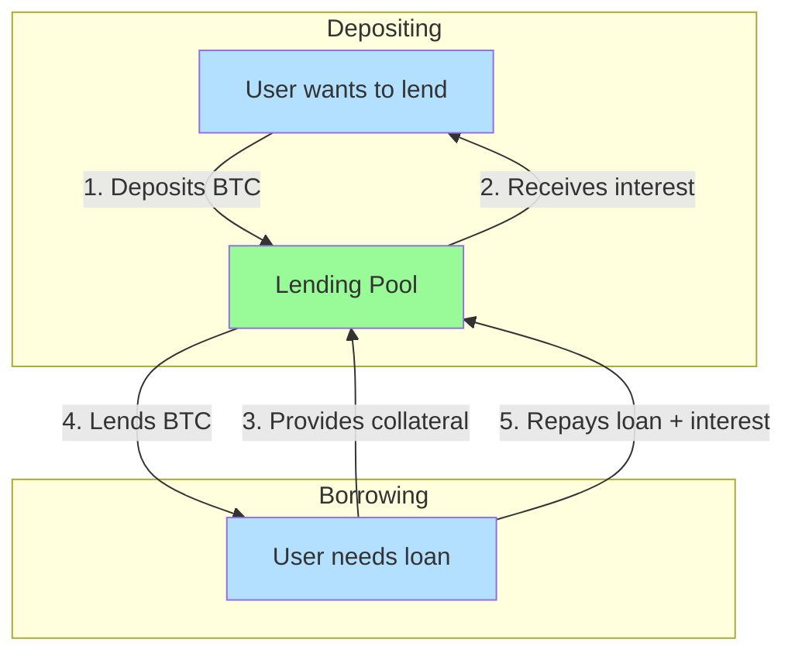
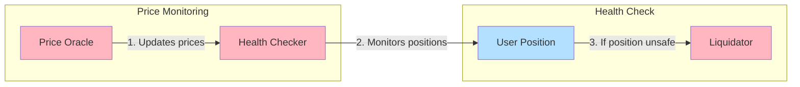

This guide walks through building a lending protocol for Bitcoin-based assets (BTC, Runes, Ordinals) on Arch Network. We'll create a decentralized lending platform similar to Aave, but specifically designed for Bitcoin-based assets.

## Prerequisites

Before starting, ensure you have:
- Completed the [environment setup](/docs/quick-start/requirements)
- A basic understanding of [Bitcoin Integration](/docs/core-concepts/bitcoin-integration)
- Familiarity with Rust programming language
- Your development environment ready with the Arch CLI installed

## System Overview

### Basic User Flow



### Safety System



### Simple Example

Let's say Alice wants to borrow BTC and Bob wants to earn interest:

1. **Bob (Lender)**
   - Deposits 1 BTC into pool
   - Earns 3% APY interest

2. **Alice (Borrower)**
   - Provides 1.5 BTC as collateral
   - Borrows 1 BTC
   - Pays 5% APY interest

3. **Safety System**
   - Monitors BTC price
   - Checks if Alice's collateral stays valuable enough
   - If BTC price drops too much, liquidates some collateral to protect Bob's deposit

## Architecture Overview

Our lending protocol consists of several key components:

### 1. Pool Accounts

Pool accounts are the core of our lending protocol. They serve as liquidity pools where users can:
- **Deposit Bitcoin-based assets** (BTC, Runes, Ordinals)
- **Earn interest on deposits**
- **Borrow against their collateral**
- **Manage protocol parameters**

Each pool account maintains:
- Total deposits and borrows
- Interest rates and utilization metrics
- Collateral factors and liquidation thresholds
- Asset-specific parameters

The pool account manages both state and UTXOs:
- **State Management**: Tracks deposits, withdrawals, and user positions
- **UTXO Management**: 
  - Maintains a collection of UTXOs for the pool's Bitcoin holdings
  - Manages UTXO creation for withdrawals
  - Handles UTXO consolidation for efficient liquidity management

### 2. Price Oracle

Track asset prices for liquidation calculations

### 3. User Positions

User positions track all user interactions with the lending pools:
- Active deposits and their earned interest
- Active borrows and their accrued interest
- Collateral values and health factors
- Liquidation history and penalties

## Data Structures

### Pool Account

```rust
use arch_program::prelude::*;
use borsh::{BorshDeserialize, BorshSerialize};

#[derive(BorshSerialize, BorshDeserialize, Debug)]
pub struct LendingPool {
    // Pool identification
    pub pool_id: u64,
    pub asset_type: AssetType,
    
    // Pool state
    pub total_deposits: u64,
    pub total_borrows: u64,
    pub utilization_rate: u64, // Basis points (0-10000)
    
    // Interest rates
    pub deposit_rate: u64,     // Basis points
    pub borrow_rate: u64,      // Basis points
    
    // Risk parameters
    pub collateral_factor: u64,    // Basis points
    pub liquidation_threshold: u64, // Basis points
    pub liquidation_penalty: u64,   // Basis points
    
    // Oracle integration
    pub price_oracle: Pubkey,
    pub last_price_update: i64,
    
    // Pool management
    pub pool_authority: Pubkey,
    pub is_active: bool,
    pub created_at: i64,
}

#[derive(BorshSerialize, BorshDeserialize, Debug, Clone)]
pub enum AssetType {
    Bitcoin,
    Rune { rune_id: String },
    Ordinal { inscription_id: String },
}
```

### User Position

```rust
#[derive(BorshSerialize, BorshDeserialize, Debug)]
pub struct UserPosition {
    // User identification
    pub user: Pubkey,
    pub position_id: u64,
    
    // Deposits
    pub deposits: Vec<Deposit>,
    pub total_deposit_value: u64,
    
    // Borrows
    pub borrows: Vec<Borrow>,
    pub total_borrow_value: u64,
    
    // Health factor
    pub health_factor: u64, // Basis points
    pub is_healthy: bool,
    
    // Liquidation
    pub liquidation_count: u32,
    pub last_liquidation: Option<i64>,
    
    // Timestamps
    pub created_at: i64,
    pub last_updated: i64,
}

#[derive(BorshSerialize, BorshDeserialize, Debug, Clone)]
pub struct Deposit {
    pub pool_id: u64,
    pub amount: u64,
    pub interest_earned: u64,
    pub deposited_at: i64,
    pub last_interest_update: i64,
}

#[derive(BorshSerialize, BorshDeserialize, Debug, Clone)]
pub struct Borrow {
    pub pool_id: u64,
    pub amount: u64,
    pub interest_accrued: u64,
    pub borrowed_at: i64,
    pub last_interest_update: i64,
}
```

## Core Instructions

### Initialize Pool

```rust
pub fn initialize_pool(
    program_id: &Pubkey,
    accounts: &[AccountInfo],
    pool_id: u64,
    asset_type: AssetType,
    collateral_factor: u64,
    liquidation_threshold: u64,
    price_oracle: Pubkey,
) -> Result<(), ProgramError> {
    let account_iter = &mut accounts.iter();
    let pool_account = next_account_info(account_iter)?;
    let authority = next_account_info(account_iter)?;
    let system_program = next_account_info(account_iter)?;
    
    // Verify authority
    if !authority.is_signer {
        return Err(ProgramError::MissingRequiredSignature);
    }
    
    // Initialize pool
    let pool = LendingPool {
        pool_id,
        asset_type,
        total_deposits: 0,
        total_borrows: 0,
        utilization_rate: 0,
        deposit_rate: 0,
        borrow_rate: 0,
        collateral_factor,
        liquidation_threshold,
        liquidation_penalty: 500, // 5% default
        price_oracle,
        last_price_update: 0,
        pool_authority: *authority.key,
        is_active: true,
        created_at: arch_program::clock::Clock::get()?.unix_timestamp,
    };
    
    // Store pool data
    let mut pool_data = pool_account.data.try_borrow_mut().unwrap();
    let serialized = pool.try_to_vec().unwrap();
    pool_data[..serialized.len()].copy_from_slice(&serialized);
    
    Ok(())
}
```

### Deposit Assets

```rust
pub fn deposit(
    program_id: &Pubkey,
    accounts: &[AccountInfo],
    amount: u64,
) -> Result<(), ProgramError> {
    let account_iter = &mut accounts.iter();
    let pool_account = next_account_info(account_iter)?;
    let user_position = next_account_info(account_iter)?;
    let user = next_account_info(account_iter)?;
    let utxo_account = next_account_info(account_iter)?;
    
    // Verify user is signer
    if !user.is_signer {
        return Err(ProgramError::MissingRequiredSignature);
    }
    
    // Load pool data
    let pool_data = pool_account.data.try_borrow().unwrap();
    let mut pool: LendingPool = LendingPool::try_from_slice(&pool_data)
        .map_err(|_| ProgramError::InvalidAccountData)?;
    
    // Load user position
    let position_data = user_position.data.try_borrow().unwrap();
    let mut position: UserPosition = UserPosition::try_from_slice(&position_data)
        .map_err(|_| ProgramError::InvalidAccountData)?;
    
    // Update pool state
    pool.total_deposits += amount;
    pool.utilization_rate = (pool.total_borrows * 10000) / pool.total_deposits;
    
    // Update interest rates based on utilization
    update_interest_rates(&mut pool);
    
    // Add deposit to user position
    let deposit = Deposit {
        pool_id: pool.pool_id,
        amount,
        interest_earned: 0,
        deposited_at: arch_program::clock::Clock::get()?.unix_timestamp,
        last_interest_update: arch_program::clock::Clock::get()?.unix_timestamp,
    };
    
    position.deposits.push(deposit);
    position.total_deposit_value += amount;
    position.last_updated = arch_program::clock::Clock::get()?.unix_timestamp;
    
    // Update health factor
    update_health_factor(&mut position, &pool);
    
    // Store updated data
    let mut pool_data_mut = pool_account.data.try_borrow_mut().unwrap();
    let serialized_pool = pool.try_to_vec().unwrap();
    pool_data_mut[..serialized_pool.len()].copy_from_slice(&serialized_pool);
    
    let mut position_data_mut = user_position.data.try_borrow_mut().unwrap();
    let serialized_position = position.try_to_vec().unwrap();
    position_data_mut[..serialized_position.len()].copy_from_slice(&serialized_position);
    
    Ok(())
}
```

### Borrow Assets

```rust
pub fn borrow(
    program_id: &Pubkey,
    accounts: &[AccountInfo],
    amount: u64,
) -> Result<(), ProgramError> {
    let account_iter = &mut accounts.iter();
    let pool_account = next_account_info(account_iter)?;
    let user_position = next_account_info(account_iter)?;
    let user = next_account_info(account_iter)?;
    let destination_utxo = next_account_info(account_iter)?;
    
    // Verify user is signer
    if !user.is_signer {
        return Err(ProgramError::MissingRequiredSignature);
    }
    
    // Load pool data
    let pool_data = pool_account.data.try_borrow().unwrap();
    let mut pool: LendingPool = LendingPool::try_from_slice(&pool_data)
        .map_err(|_| ProgramError::InvalidAccountData)?;
    
    // Load user position
    let position_data = user_position.data.try_borrow().unwrap();
    let mut position: UserPosition = UserPosition::try_from_slice(&position_data)
        .map_err(|_| ProgramError::InvalidAccountData)?;
    
    // Check if pool has sufficient liquidity
    if pool.total_deposits - pool.total_borrows < amount {
        return Err(ProgramError::InsufficientFunds);
    }
    
    // Check health factor after borrow
    let new_borrow_value = position.total_borrow_value + amount;
    let health_factor = calculate_health_factor(
        position.total_deposit_value,
        new_borrow_value,
        pool.collateral_factor,
    );
    
    if health_factor < 10000 { // Less than 100% collateralized
        return Err(ProgramError::InvalidAccountData);
    }
    
    // Update pool state
    pool.total_borrows += amount;
    pool.utilization_rate = (pool.total_borrows * 10000) / pool.total_deposits;
    update_interest_rates(&mut pool);
    
    // Add borrow to user position
    let borrow = Borrow {
        pool_id: pool.pool_id,
        amount,
        interest_accrued: 0,
        borrowed_at: arch_program::clock::Clock::get()?.unix_timestamp,
        last_interest_update: arch_program::clock::Clock::get()?.unix_timestamp,
    };
    
    position.borrows.push(borrow);
    position.total_borrow_value += amount;
    position.last_updated = arch_program::clock::Clock::get()?.unix_timestamp;
    
    // Update health factor
    update_health_factor(&mut position, &pool);
    
    // Store updated data
    let mut pool_data_mut = pool_account.data.try_borrow_mut().unwrap();
    let serialized_pool = pool.try_to_vec().unwrap();
    pool_data_mut[..serialized_pool.len()].copy_from_slice(&serialized_pool);
    
    let mut position_data_mut = user_position.data.try_borrow_mut().unwrap();
    let serialized_position = position.try_to_vec().unwrap();
    position_data_mut[..serialized_position.len()].copy_from_slice(&serialized_position);
    
    Ok(())
}
```

## Interest Rate Calculation

```rust
fn update_interest_rates(pool: &mut LendingPool) {
    let utilization = pool.utilization_rate;
    
    // Linear interest rate model
    // Base rate + (utilization * slope)
    let base_rate = 200; // 2% base rate
    let slope = 300;     // 3% slope
    
    pool.borrow_rate = base_rate + (utilization * slope / 10000);
    
    // Deposit rate is borrow rate * utilization * (1 - reserve factor)
    let reserve_factor = 1000; // 10% reserve factor
    pool.deposit_rate = (pool.borrow_rate * utilization * (10000 - reserve_factor)) / (10000 * 10000);
}
```

## Health Factor Calculation

```rust
fn calculate_health_factor(
    total_deposit_value: u64,
    total_borrow_value: u64,
    collateral_factor: u64,
) -> u64 {
    if total_borrow_value == 0 {
        return u64::MAX; // No borrows = healthy
    }
    
    let collateral_value = total_deposit_value * collateral_factor / 10000;
    (collateral_value * 10000) / total_borrow_value
}

fn update_health_factor(position: &mut UserPosition, pool: &LendingPool) {
    position.health_factor = calculate_health_factor(
        position.total_deposit_value,
        position.total_borrow_value,
        pool.collateral_factor,
    );
    
    position.is_healthy = position.health_factor >= 10000;
}
```

## Liquidation System

### Liquidate Position

```rust
pub fn liquidate(
    program_id: &Pubkey,
    accounts: &[AccountInfo],
    liquidate_amount: u64,
) -> Result<(), ProgramError> {
    let account_iter = &mut accounts.iter();
    let pool_account = next_account_info(account_iter)?;
    let user_position = next_account_info(account_iter)?;
    let liquidator = next_account_info(account_iter)?;
    let liquidator_position = next_account_info(account_iter)?;
    
    // Verify liquidator is signer
    if !liquidator.is_signer {
        return Err(ProgramError::MissingRequiredSignature);
    }
    
    // Load pool data
    let pool_data = pool_account.data.try_borrow().unwrap();
    let pool: LendingPool = LendingPool::try_from_slice(&pool_data)
        .map_err(|_| ProgramError::InvalidAccountData)?;
    
    // Load user position
    let position_data = user_position.data.try_borrow().unwrap();
    let mut position: UserPosition = UserPosition::try_from_slice(&position_data)
        .map_err(|_| ProgramError::InvalidAccountData)?;
    
    // Check if position is unhealthy
    if position.is_healthy {
        return Err(ProgramError::InvalidAccountData);
    }
    
    // Calculate liquidation amount
    let max_liquidation = position.total_deposit_value * 5000 / 10000; // Max 50% of deposits
    let actual_liquidation = liquidate_amount.min(max_liquidation);
    
    // Apply liquidation penalty
    let penalty_amount = actual_liquidation * pool.liquidation_penalty / 10000;
    let liquidator_reward = actual_liquidation + penalty_amount;
    
    // Update position
    position.total_deposit_value -= actual_liquidation;
    position.liquidation_count += 1;
    position.last_liquidation = Some(arch_program::clock::Clock::get()?.unix_timestamp);
    
    // Update health factor
    update_health_factor(&mut position, &pool);
    
    // Store updated position
    let mut position_data_mut = user_position.data.try_borrow_mut().unwrap();
    let serialized_position = position.try_to_vec().unwrap();
    position_data_mut[..serialized_position.len()].copy_from_slice(&serialized_position);
    
    Ok(())
}
```

## Oracle Integration

### Price Update

```rust
pub fn update_price(
    program_id: &Pubkey,
    accounts: &[AccountInfo],
    new_price: u64,
) -> Result<(), ProgramError> {
    let account_iter = &mut accounts.iter();
    let pool_account = next_account_info(account_iter)?;
    let oracle = next_account_info(account_iter)?;
    
    // Verify oracle authority
    if !oracle.is_signer {
        return Err(ProgramError::MissingRequiredSignature);
    }
    
    // Load pool data
    let pool_data = pool_account.data.try_borrow().unwrap();
    let mut pool: LendingPool = LendingPool::try_from_slice(&pool_data)
        .map_err(|_| ProgramError::InvalidAccountData)?;
    
    // Verify oracle matches
    if *oracle.key != pool.price_oracle {
        return Err(ProgramError::InvalidAccountData);
    }
    
    // Update price and timestamp
    pool.last_price_update = arch_program::clock::Clock::get()?.unix_timestamp;
    
    // Store updated pool
    let mut pool_data_mut = pool_account.data.try_borrow_mut().unwrap();
    let serialized_pool = pool.try_to_vec().unwrap();
    pool_data_mut[..serialized_pool.len()].copy_from_slice(&serialized_pool);
    
    Ok(())
}
```

## Testing

### Unit Tests

```rust
#[cfg(test)]
mod tests {
    use super::*;
    use arch_program::test_utils::*;

    #[test]
    fn test_pool_initialization() {
        let program_id = Pubkey::new_unique();
        let pool_account = create_test_account(&program_id, 1024);
        let authority = create_test_account(&program_id, 0);
        
        let asset_type = AssetType::Bitcoin;
        let result = initialize_pool(
            &program_id,
            &[pool_account, authority],
            1,
            asset_type,
            8000, // 80% collateral factor
            8500, // 85% liquidation threshold
            Pubkey::new_unique(),
        );
        
        assert!(result.is_ok());
    }

    #[test]
    fn test_deposit() {
        let program_id = Pubkey::new_unique();
        let pool_account = create_test_account(&program_id, 1024);
        let user_position = create_test_account(&program_id, 1024);
        let user = create_test_account(&program_id, 0);
        
        let result = deposit(
            &program_id,
            &[pool_account, user_position, user],
            1000000, // 1 BTC in satoshis
        );
        
        assert!(result.is_ok());
    }

    #[test]
    fn test_health_factor_calculation() {
        let health_factor = calculate_health_factor(
            1000000, // 1 BTC deposits
            500000,  // 0.5 BTC borrows
            8000,    // 80% collateral factor
        );
        
        assert_eq!(health_factor, 16000); // 160% collateralized
    }
}
```

## Deployment

### Build and Deploy

```bash
# Build the program
cargo build-sbf

# Deploy to local network
arch-cli program deploy target/deploy/lending_protocol.so

# Deploy to testnet
arch-cli program deploy target/deploy/lending_protocol.so --url testnet
```

### Initialize Pool

```bash
# Initialize a Bitcoin lending pool
arch-cli program call <PROGRAM_ID> \
  --accounts ~/pool_account.key,~/authority.key \
  --instruction-data $(echo '{"InitializePool":{"pool_id":1,"asset_type":"Bitcoin","collateral_factor":8000,"liquidation_threshold":8500,"price_oracle":"<ORACLE_ADDRESS>"}}' | base64) \
  --keypair-path ~/authority.key
```

## Security Considerations

### 1. Oracle Security
- Use multiple price sources
- Implement price deviation checks
- Add circuit breakers for extreme price movements

### 2. Liquidation Security
- Implement proper liquidation incentives
- Add liquidation caps to prevent over-liquidation
- Monitor liquidation patterns for abuse

### 3. Interest Rate Security
- Implement rate limits for interest rate changes
- Add emergency pause functionality
- Monitor for interest rate manipulation

### 4. Access Control
- Implement proper authority management
- Add multi-signature requirements for critical operations
- Regular security audits

## Best Practices

### 1. Risk Management
- Conservative collateral factors
- Regular health factor monitoring
- Automated liquidation systems

### 2. User Experience
- Clear health factor displays
- Liquidation warnings
- Easy deposit/withdrawal flows

### 3. Protocol Governance
- Community-driven parameter updates
- Transparent decision making
- Regular protocol upgrades

## Next Steps

<Cards>
  <Card title="Oracle Program Guide" href="/docs/development/how-to-write-oracle-program">
    Learn to build price oracles for your lending protocol
  </Card>
  <Card title="Runes Swap Guide" href="/docs/defi-applications/how-to-build-runes-swap">
    Build a token swap protocol
  </Card>
  <Card title="APL Token Program" href="/docs/APL/token-program">
    Use APL tokens in your lending protocol
  </Card>
  <Card title="Arch Examples" href="https://github.com/Arch-Network/arch-examples" external>
    Explore more example programs
  </Card>
</Cards>

## Resources

<Cards>
  <Card title="Arch Examples Repository" href="https://github.com/Arch-Network/arch-examples" external>
    Complete lending protocol implementation
  </Card>
  <Card title="Bitcoin Integration" href="/docs/core-concepts/bitcoin-integration">
    Understand Bitcoin integration in Arch
  </Card>
  <Card title="Program Development" href="/docs/development/writing-your-first-program">
    Master Arch program development
  </Card>
  <Card title="Community Discord" href="https://discord.gg/archnetwork" external>
    Get help from the community
  </Card>
</Cards>
