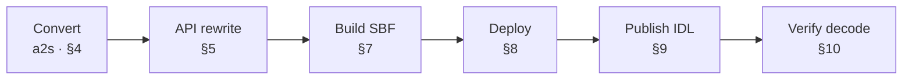
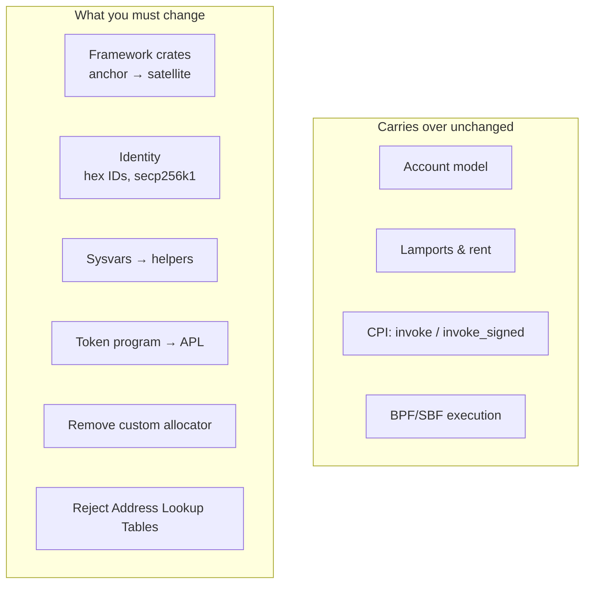
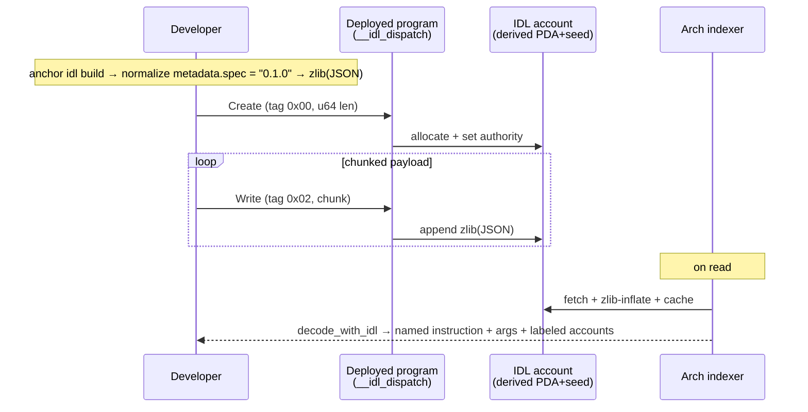

A practical, start-to-finish porting guide for developers who already have a Solana Anchor program and want to bring it to **Arch Network**. We use the real-world **Squads V4** multisig as our worked example — a non-trivial, production-grade Anchor program — and document every wall we hit and how we got over it.

**Who this is for:** you have a working Solana Anchor program and want it running on Arch. You're comfortable with Rust, Anchor, and the SBF build flow — you do **not** need prior Arch experience.

The whole port is six stages. The diagram below doubles as a map of this guide — each box notes the section that covers it:



## 1. TL;DR — what you'll achieve

We took **Squads V4** (Squads Protocol's audited Solana multisig, licensed **AGPL-3.0**) and ported it to **Arch Network**, deployed it to Arch testnet, published its IDL so the Arch Explorer decodes instructions by name, and proved it end-to-end with two successful, decoded on-chain transactions. We also built a Bitcoin-wallet-connected web UI on top of it.

By the end of this guide you will be able to:

- Convert an Anchor program to Arch's Anchor fork (**Satellite**) using the **a2s** (`anchor-to-satellite`) converter, then apply the manual fixups a2s can't do.
- Understand the handful of architectural differences that *actually* matter (signing scheme, program IDs, sysvars, allocator, Address Lookup Tables).
- Build the program with the SBF toolchain and get past the `edition2024` dependency-pinning trap.
- Deploy with `arch-cli`, publish the IDL so the Explorer can decode your instructions, and verify everything against a live testnet program.

**The finished artifacts (Arch testnet):**

| Thing | Value |
|---|---|
| Program ID (hex) | `60ecce876888d47a7b6809e1e8ecc8e7afb11fd0aa741ea368a7128ffc18598e` |
| Program ID (base58) | `7XMaBUNuUYPwH9jSzJFTpvSWP1EHBNYf26NqJDUP7S6y` |
| Published IDL account | `2c2806defae4443cd763ab7e6ba755c61ed75e29717fc2a88e40c18626e199c0` |
| Testnet RPC | `https://rpc.testnet.arch.network` |
| Explorer | `https://explorer.arch.network` (Testnet) |
| Proof tx #1 (`program_config_init`) | `9399b7c32146ff4d32e8ec17f7959ac806bfa3c8f33bdd084bd09a55dd9e12f5` |
| Proof tx #2 (`multisig_create_v2`) | `1c33a8c6a240adb77f0c8a08e5e4b5363237c59936cbe688104b94021e4c3f69` |

> **License note up front:** Squads V4 is **AGPL-3.0**. Anything you derive from it — including this port and any UI you ship — must remain **AGPL-3.0** with attribution to **Squads Protocol**. See §12.

## 2. Mental model: Arch vs Solana

Arch Network is, from a program author's perspective, *remarkably close* to Solana. It keeps the **account model**, **lamports**, **cross-program invocation (CPI)**, and **BPF/SBF** execution. The differences are concentrated in identity/signing, program-ID encoding, sysvar access, and the fact that Arch is **Bitcoin-anchored**.

At a glance, most of the runtime carries over untouched; the work is concentrated in a short list of changes:



| Concept | Solana | Arch |
|---|---|---|
| Account model | Accounts own lamports + data | **Same** |
| Execution | BPF/SBF, `cargo-build-sbf` | **Same** (SBF) |
| CPI | `invoke` / `invoke_signed` | **Same** |
| Lamports / rent model | Yes | **Same** (rent via helper, see below) |
| Anchor framework | `anchor-lang`, `anchor-spl` | **Satellite**: `arch-satellite-lang`, `arch-satellite-apl` |
| Token program | SPL Token / Token-2022 | **APL** (`apl-token`) |
| Signing scheme | ed25519 | **secp256k1 / BIP-322 Schnorr** |
| Program ID encoding | base58 (ed25519 pubkey) | **64-char hex** (secp256k1) |
| Settlement / finality | Solana consensus | **Bitcoin-anchored** |
| Sysvars | Passed as accounts *or* `Sysvar::get()` | **Not passed as accounts** — use `arch_program` helpers |
| Address Lookup Tables (ALTs) | Supported | **Unsupported** (must be rejected) |
| Wallets | Phantom/Solflare (ed25519) | **Taproot Bitcoin wallets** (Xverse/Unisat), BIP-322 |

The mental shift: **your program logic barely changes**; what changes is the *framework crate names*, *how you reach sysvars*, *the allocator*, *ALT handling*, and everything around **identity** (hex IDs, secp256k1 signing).

## 3. Prerequisites & toolchain

You'll need:

- **`arch-cli`** — Arch's deploy/account tool. (The native `arch-cli idl` subcommand used in §9.4 is **not yet released** — see the caveat there; use the manual path in §9.3 until it ships.)
- **`cargo-build-sbf`** — comes with Solana/Agave **platform-tools**. This is the same SBF compiler you already use for Solana.
- **A pinned Rust toolchain** via `rust-toolchain.toml` in the program crate. Pinning matters because the SBF-bundled Cargo is older than your host Cargo (see §7).
- **a2s** — the `anchor-to-satellite` converter:

```bash
cargo install --git https://github.com/Arch-Network/anchor-to-satellite --locked
```

- **The Satellite `anchor` CLI** — needed for `anchor idl build` (Satellite's fork of Anchor's IDL generator).

> **Toolchain pin:** the program crate's `rust-toolchain.toml` pins `channel = "1.94.0"` (with the `rustfmt` and `clippy` components).

## 4. Convert with a2s

`a2s` does the bulk of the mechanical rewrite for you. Run **analyze** first to get a report of what it will touch, then **convert**:

```bash
a2s analyze ./programs/squads_multisig_program
a2s convert ./programs/squads_multisig_program
```

### The first gotcha: crate names

`a2s` emits dependencies named **`satellite_lang` / `satellite_apl`** and wires them up with **relative-path** `Cargo.toml` deps. But the Satellite macros (`#[program]`, `#[derive(Accounts)]`, etc.) expand to code that references the **published crate names** `arch_satellite_lang` / `arch_satellite_apl`. If you leave the a2s output as-is, the macro-expanded code won't resolve.

**Fix:** do a global rename and point `Cargo.toml` at the crates.io versions.

```bash
grep -rl 'satellite_lang' src/ | xargs sed -i '' 's/satellite_lang/arch_satellite_lang/g'
grep -rl 'satellite_apl' src/ | xargs sed -i '' 's/satellite_apl/arch_satellite_apl/g'
```

Then set your dependency versions (these are the pins from the program's workspace `Cargo.toml`):

```toml
[dependencies]
arch-satellite-lang = "=0.31.5"
arch-satellite-apl = "=0.31.5"
arch_program = "=0.6.4"
borsh = "1.5"
```

> These match the workspace `Cargo.toml`/`Cargo.lock` exactly: `arch-satellite-lang` and `arch-satellite-apl` are pinned `=0.31.5`, `arch_program` is pinned `=0.6.4`, and `borsh` is `1.5`. (In the real workspace, `arch-satellite-lang` carries the `derive`/`init-if-needed` features and `arch-satellite-apl` the `token`/`associated_token` features.)

## 5. The porting reference (API mapping)

This is the table you'll come back to. Each row is a concrete substitution we made converting Squads V4.

| Area | Solana / Anchor | Arch / Satellite |
|---|---|---|
| Framework crate | `anchor_lang` | `arch_satellite_lang` |
| SPL helpers | `anchor_spl` | `arch_satellite_apl` |
| Token program | `spl-token` / Token-2022 | `apl-token` |
| Token account type | `InterfaceAccount<'info, TokenAccount>` | `Account<'info, TokenAccount>` |
| Program ID literal | base58 ed25519 in `declare_id!` | **64-char hex** in `declare_id!` |
| Hardcoded `Pubkey` consts | base58 (e.g. Squads' `INITIALIZER`) | **hex** secp256k1 |
| Clock sysvar | `Clock::get()?` | `arch_program::program::get_clock()` |
| Rent / min balance | `Rent::get()?.minimum_balance(n)` | `arch_program::rent::minimum_rent(n)` |
| Hashing | `solana_program::hash::hash(&[..])` | `arch_program::hashing_functions::sha256(&[..])` |
| Packed len | `solana_borsh::v1::get_instance_packed_len(x)?` | `borsh::to_vec(x).unwrap().len()` |
| Pubkey → bytes (serialize) | `pubkey.try_to_vec()?` | `pubkey.serialize().to_vec()` |
| Pubkey → raw bytes | `pubkey.to_bytes()` | `pubkey.serialize()` |
| System program ID | `system_program::ID` | `SYSTEM_PROGRAM_ID` |
| `create_account` CPI | takes `rent` | **no `rent` param** (signature differs) |
| Low-level types | `solana_program::*` | `arch_program::*` |
| Custom allocator | program-defined `#[global_allocator]` | **remove it** (entrypoint defines one) |
| Address Lookup Tables | supported | **unsupported — reject** |

### Per-area notes

**Imports.** The dominant change is `anchor_lang` → `arch_satellite_lang` and `anchor_spl` → `arch_satellite_apl`. Most `use` statements convert mechanically; a2s handles the easy ones.

**Token accounts.** Squads uses token accounts in a couple of spots. Solana's Token-2022 era pushed people toward `InterfaceAccount`; Arch's APL model uses a single token program, so `InterfaceAccount<'info, TokenAccount>` becomes `Account<'info, TokenAccount>`.

**Program IDs are hex.** `declare_id!` takes a **64-char hex** string, not base58. Our deployed program ID is `60ecce876888d47a7b6809e1e8ecc8e7afb11fd0aa741ea368a7128ffc18598e`.

**Hardcoded keys.** Squads embeds a gated `INITIALIZER` `Pubkey`. Any hardcoded base58 key like this must be re-encoded to Arch's hex secp256k1 form. (For the end-to-end proof we repointed `INITIALIZER` to a key we control — see §10.)

**Sysvars are not accounts on Arch.** This is the most common porting surprise. On Arch you do **not** pass `Clock`/`Rent` as accounts; you call helpers:

```rust
// Solana / Anchor
let now = Clock::get()?.unix_timestamp;
let min = Rent::get()?.minimum_balance(space);

// Arch / Satellite
let now = arch_program::program::get_clock().unix_timestamp;
let min = arch_program::rent::minimum_rent(space);
```

**Hashing.**

```rust
// Solana
use solana_program::hash::hash;
let h = hash(&data);

// Arch
use arch_program::hashing_functions::sha256;
let h = sha256(&data);
```

**Borsh helpers.** Squads used `solana_borsh`'s `get_instance_packed_len`; on Arch use plain borsh:

```rust
// Solana
let len = solana_borsh::v1::get_instance_packed_len(&value)?;

// Arch
let len = borsh::to_vec(&value).unwrap().len();
```

**Pubkey serialization.** `Pubkey::to_bytes()` → `Pubkey::serialize()`, and `pubkey.try_to_vec()?` → `pubkey.serialize().to_vec()`.

**System program.** `system_program::ID` → `SYSTEM_PROGRAM_ID`, and the `create_account` CPI **signature differs** (Arch's version has no `rent` parameter — rent is handled via the `minimum_rent` helper, not passed through the instruction).

**IDL build for custom types.** Anchor's IDL generator can't represent some custom types — Squads' `SmallVec`, for instance. `SmallVec` uses a compact (u8/u16) length prefix that Anchor's IDL type system can't express (it only models `vec` with a u32 prefix). To keep `anchor idl build` working you add a minimal `IdlBuild` impl, gated behind the `idl-build` feature so it doesn't bloat the on-chain binary. In `src/utils/small_vec.rs` this is simply the default (no-op) blanket impl, which omits the type from the IDL:

```rust
// src/utils/small_vec.rs
#[cfg(feature = "idl-build")]
impl<L, T> arch_satellite_lang::idl::build::IdlBuild for SmallVec<L, T> {}
```

The practical effect: every instruction decodes on the Explorer except the trailing `SmallVec` arg of the vault/batch transaction-message instructions.

## 6. Architectural must-dos

These four are not optional. Skip any one and the program either won't build, won't load, or will silently misbehave.

### 6.1 Remove the custom global allocator

Squads V4 ships a **custom `#[global_allocator]`**. On Arch this **conflicts**: Arch's `entrypoint!` macro defines a global allocator **unconditionally** (a bump allocator over the default ~32KB heap). Two global allocators = compile error. **Delete Squads' custom allocator** and let the entrypoint provide it.

### 6.2 Strip Address Lookup Tables — and reject them explicitly

**Arch does not support Address Lookup Tables.** It's not enough to stop *using* them; Squads' transaction-execution path inspects incoming v0-style messages, and you must **explicitly reject** any message that carries `address_table_lookups`. We did this in `src/utils/executable_transaction_message.rs`, inside `ExecutableTransactionMessage::new_validated`: the message's lookups must be empty and no lookup-table account infos may be passed.

```rust
// src/utils/executable_transaction_message.rs
require!(
    message.address_table_lookups.is_empty(),
    MultisigError::InvalidTransactionMessage
);
require_eq!(
    address_lookup_table_account_infos.len(),
    0,
    MultisigError::InvalidNumberOfAccounts
);
```

So a message declaring ALTs fails with `MultisigError::InvalidTransactionMessage`, and any stray lookup-table account infos fail with `MultisigError::InvalidNumberOfAccounts`.

### 6.3 Sysvars via helpers (recap)

Covered in §5: `Clock::get()` → `get_clock()`, `Rent::get()...minimum_balance()` → `minimum_rent()`. Audit every sysvar touch; these are easy to miss because they compile differently rather than failing loudly.

### 6.4 Token program → APL

Replace `spl-token`/Token-2022 with `apl-token`, and `InterfaceAccount` token types with `Account`. Behaviorally APL mirrors SPL Token closely, so the CPI shapes are familiar.

## 7. Building for SBF: the `edition2024` dependency trap

`cargo-build-sbf` bundles its **own, older Cargo** (observed: **1.84.1**). Some *transitive* dependencies declare `edition = "2024"`, which that older Cargo **cannot parse** — the build fails resolving the graph, not compiling your code.

**Fix:** pin the offending transitive crates back with `cargo update --precise`:

```bash
cargo update -p proc-macro-crate --precise 3.2.0
cargo update -p indexmap --precise 2.9.0
cargo update -p unicode-segmentation --precise 1.12.0
```

> These three pins match `Cargo.lock`: `proc-macro-crate` `3.2.0`, `indexmap` `2.9.0`, `unicode-segmentation` `1.12.0`.

Then build:

```bash
cargo-build-sbf
# => target/deploy/squads_multisig_program.so
```

Optionally strip the artifact before deploy:

```bash
llvm-objcopy --strip-all \
  target/deploy/squads_multisig_program.so \
  target/deploy/squads_multisig_program.stripped.so
```

## 8. Deploying with `arch-cli`

Two things trip people up: the deploy argument is a **directory**, and the client may **time out on finalization even when the deploy succeeded**.

### 8.1 The deploy directory layout

```text
deploy/
  squads_multisig_program.so                # the bytecode
  squads_multisig_program-keypair.json      # the program account keypair
  squads_multisig_program-authority.json    # the upgrade authority keypair
```

### 8.2 Fund the authority, then deploy

```bash
arch-cli account airdrop --keypair deploy/squads_multisig_program-authority.json
arch-cli deploy ./deploy
```

### 8.3 The finalization timeout (don't panic)

The client frequently **times out at step 3/3 (finalization)** even when the upgrade actually landed. Verify directly:

```bash
arch-cli show 60ecce876888d47a7b6809e1e8ecc8e7afb11fd0aa741ea368a7128ffc18598e
```

If `show` reports the account as **executable**, you're deployed.

## 9. Publishing the IDL (so the Explorer decodes your instructions)

**This is a separate step from deploying bytecode.** You write the IDL into a derived account by driving the program's own `__idl_dispatch` handlers; the indexer later fetches it and decodes instructions on read:



### 9.1 Why you can't just use Satellite's `anchor idl ...`

Upstream Satellite's `anchor idl init/upgrade/fetch` is **Solana-only**: it loads **ed25519** keypairs, talks **Solana JSON-RPC**, and **signs ed25519**. None of that works against Arch, which signs **secp256k1 / BIP-322 Schnorr**.

### 9.2 The on-chain IDL account layout

```text
[ 8-byte discriminator ][ 32-byte authority ][ 4-byte len (LE) ][ zlib(JSON) ]
```

Address derivation:

```text
base        = find_program_address([], program_id)   // PDA, empty seeds
idl_address = create_with_seed(base, "anchor:idl", program_id)
```

### 9.3 Driving the program's `__idl_dispatch` directly over Arch RPC

The deployed program embeds the standard Anchor `__idl_dispatch` handlers:

- IDL instruction **selector prefix** is `40 f4 bc 78 a7 e9 69 0a` = `sha256("anchor:idl")[..8]`.
- **Create**: tag `0x00` followed by a `u64` length.
- **Write**: tag `0x02` followed by a chunk of the (zlib-compressed) payload.

**Critical normalization:** set `metadata.spec` to **`"0.1.0"`** before publishing. Satellite stamps its own framework version (e.g. `0.31.5`) into `metadata.spec`, and **both the CLI and the Arch indexer's parser reject** that.

### 9.4 We productized this: `arch-cli idl`

> **Not yet released.** The native **`arch-cli idl`** subcommand below is proposed in **[PR #2341](https://github.com/Arch-Network/arch-network/pull/2341)**, which is still **open against `dev` and not merged**. Until it ships in a released `arch-cli`, these commands won't exist on your machine — use the manual `__idl_dispatch` path in §9.3 (which works today) to publish the IDL. The commands here document the intended interface once the PR lands.

We added a native **`arch-cli idl init / fetch / upgrade`** subcommand. It reuses arch-cli's existing `build_and_sign_transaction` path and does the `metadata.spec` normalization for you. This is proposed as **PR #2341** against `Arch-Network/arch-network`'s `dev` branch.

In this subcommand the program id is a **positional** argument (base58 32-byte string or 64-char hex), the IDL file is passed with `--filepath`, and the signing keypair with `--authority`:

```bash
arch-cli idl init    <HEX> --filepath target/idl/squads_multisig_program.json --authority deploy/squads_multisig_program-authority.json
arch-cli idl fetch   <HEX>
arch-cli idl upgrade <HEX> --filepath target/idl/squads_multisig_program.json --authority deploy/squads_multisig_program-authority.json
```

Our published IDL account is `2c2806defae4443cd763ab7e6ba755c61ed75e29717fc2a88e40c18626e199c0`.

### 9.5 How Explorer decoding actually works

The Arch indexer / api-server:

1. **Auto-derives** the IDL account address from the program ID.
2. **Fetches, zlib-inflates, and caches** the IDL (in a `program_idls` table).
3. On **read**, `decode_with_idl` matches the **8-byte instruction discriminator**, **borsh-decodes the args**, and **labels the accounts**.

Because decoding happens **on read** (via the indexer's discriminator-match path), the named, decoded instructions surface **even for failed transactions**.

## 10. End-to-end proof

Squads' first instructions are **gated** behind that hardcoded `INITIALIZER` key, so to get a *successful* call we **repointed `INITIALIZER` to a key we control**, rebuilt, and redeployed. Then we ran the bootstrap sequence:

| Step | Instruction | Tx |
|---|---|---|
| 1 | `program_config_init` | `9399b7c32146ff4d32e8ec17f7959ac806bfa3c8f33bdd084bd09a55dd9e12f5` |
| 2 | `multisig_create_v2` | `1c33a8c6a240adb77f0c8a08e5e4b5363237c59936cbe688104b94021e4c3f69` |

Both show the instruction name, decoded arguments, and labeled accounts on the Explorer (`https://explorer.arch.network`, **Testnet**), confirming the full pipeline (deploy → IDL publish → indexer decode) works.

## 11. (Optional) A wallet-connected UI

We built a **Vite + React + TypeScript** UI that connects a **taproot Bitcoin wallet** (Xverse / Unisat) and signs Arch transactions via **BIP-322 Schnorr**. Three gotchas each cost real time.

### Gotcha 1 — Node polyfills in the browser (order matters)

Use **`vite-plugin-node-polyfills`** rather than hand-rolling shims.

- **Injection order matters.** A hand-rolled shim assigned **after** the import graph evaluates produces a **blank page**.
- Externalizing `util` and a missing `process.version` will **crash `readable-stream`**.

```ts
// vite.config.ts
import { defineConfig } from "vite";
import { nodePolyfills } from "vite-plugin-node-polyfills";

export default defineConfig({
  plugins: [
    nodePolyfills({ globals: { Buffer: true, process: true, global: true } }),
  ],
});
```

### Gotcha 2 — request Bitcoin **Testnet4**, not testnet3

Arch testnet is anchored to **Bitcoin Testnet4**. Asking the wallet for **testnet3** yields a **network mismatch**. Request **Testnet4** explicitly.

### Gotcha 3 — `tapInternalKey` must be the wallet's INTERNAL x-only key

When constructing the BIP-86 / taproot input, `tapInternalKey` must be the wallet's **internal x-only public key**, **not** the address's output (tweaked) key. Pass the tweaked key and you **double-tweak**, and Arch rejects the transaction with `error checking transaction sigs`.

## 12. Licensing & compliance

**Squads V4 is licensed under AGPL-3.0.** This port is a **derivative work** and must remain **AGPL-3.0**; any **redistribution** (including running it as a network service) must make corresponding source available under AGPL-3.0, and you must **retain attribution to Squads Protocol**. If you're porting a different program, check its license before redistributing.

## 13. Copy-paste porting checklist

```text
# === Setup ===
[ ] Install arch-cli
[ ] Install cargo-build-sbf (Solana/Agave platform-tools)
[ ] Add a rust-toolchain.toml pin to the program crate
[ ] cargo install --git https://github.com/Arch-Network/anchor-to-satellite --locked
[ ] Install the Satellite `anchor` CLI (for `anchor idl build`)

# === Convert ===
[ ] a2s analyze ./programs/<prog>
[ ] a2s convert ./programs/<prog>
[ ] Global rename satellite_lang -> arch_satellite_lang
[ ] Global rename satellite_apl -> arch_satellite_apl
[ ] Point Cargo.toml at crates.io versions (NOT relative paths)

# === API rewrites ===
[ ] anchor_lang -> arch_satellite_lang ; anchor_spl -> arch_satellite_apl
[ ] spl-token/Token-2022 -> apl-token ; InterfaceAccount -> Account
[ ] declare_id! -> 64-char hex ; convert hardcoded Pubkeys to hex
[ ] Clock::get() -> arch_program::program::get_clock()
[ ] Rent::get()...minimum_balance() -> arch_program::rent::minimum_rent()
[ ] solana_program::hash::hash -> arch_program::hashing_functions::sha256
[ ] solana_borsh get_instance_packed_len(x) -> borsh::to_vec(x).unwrap().len()
[ ] Pubkey.try_to_vec() -> Pubkey.serialize().to_vec()
[ ] Pubkey::to_bytes() -> Pubkey::serialize()
[ ] system_program::ID -> SYSTEM_PROGRAM_ID ; fix create_account CPI (no rent)
[ ] solana_program::* low-level types -> arch_program::*

# === Architectural must-dos ===
[ ] DELETE the custom #[global_allocator]
[ ] Strip ALT logic; explicitly REJECT messages with address_table_lookups
[ ] Audit every sysvar access (Clock/Rent) -> helpers
[ ] Add #[cfg(feature="idl-build")] IdlBuild impls for non-IDL types (SmallVec)

# === Build ===
[ ] cargo-build-sbf
[ ] On edition2024 error: cargo update --precise the offending transitive deps
[ ] Produce target/deploy/<prog>.so (optionally llvm-objcopy --strip-all)

# === Deploy ===
[ ] Assemble deploy dir: <prog>.so + <prog>-keypair.json + <prog>-authority.json
[ ] arch-cli account airdrop (fund the authority)
[ ] arch-cli deploy ./deploy (pass the DIRECTORY)
[ ] If finalization times out: arch-cli show <program-id> to confirm executable
[ ] Record the program ID (hex)

# === IDL ===
[ ] anchor idl build (Satellite CLI)
[ ] Normalize metadata.spec -> "0.1.0"
[ ] Publish via manual __idl_dispatch (works today) OR arch-cli idl init (pending PR #2341, unreleased)
[ ] Fetch/inflate the IDL account to verify it landed
[ ] Confirm the indexer decodes a real tx by name (discriminator match)

# === Compliance ===
[ ] Keep AGPL-3.0 LICENSE + attribution to Squads Protocol
```

## 14. Links

- **Ported program (public repo):** https://github.com/Arch-Network/arch-squads
- **a2s (anchor-to-satellite) converter:** https://github.com/Arch-Network/anchor-to-satellite
- **`arch-cli idl` PR #2341 (open / not yet released):** https://github.com/Arch-Network/arch-network/pull/2341
- **Arch Explorer (Testnet):** https://explorer.arch.network
- **Arch testnet RPC:** https://rpc.testnet.arch.network
- **Squads Protocol (upstream, AGPL-3.0):** https://github.com/Squads-Protocol/v4
- **RFC on Address Lookup Tables (Arch):** not yet public — see the in-repo draft at `docs/rfcs/0001-address-lookup-tables.md` in `Arch-Network/arch-network` (pending publication).

### Appendix — a note on the journey

The honest summary: **the program logic was the easy part.** a2s plus a focused set of substitutions (sysvars, allocator, ALTs, token program, hex IDs) got us a compiling SBF binary. The two things that ate the most time were entirely *outside* the program: (1) the **`edition2024` SBF-Cargo trap**, solved by pinning transitive deps, and (2) **getting the IDL on-chain** so the Explorer decodes instructions. The latter works today via the manual `__idl_dispatch` path (§9.3), and will get easier once the native `arch-cli idl` subcommand (PR #2341, currently open/unreleased) lands.
