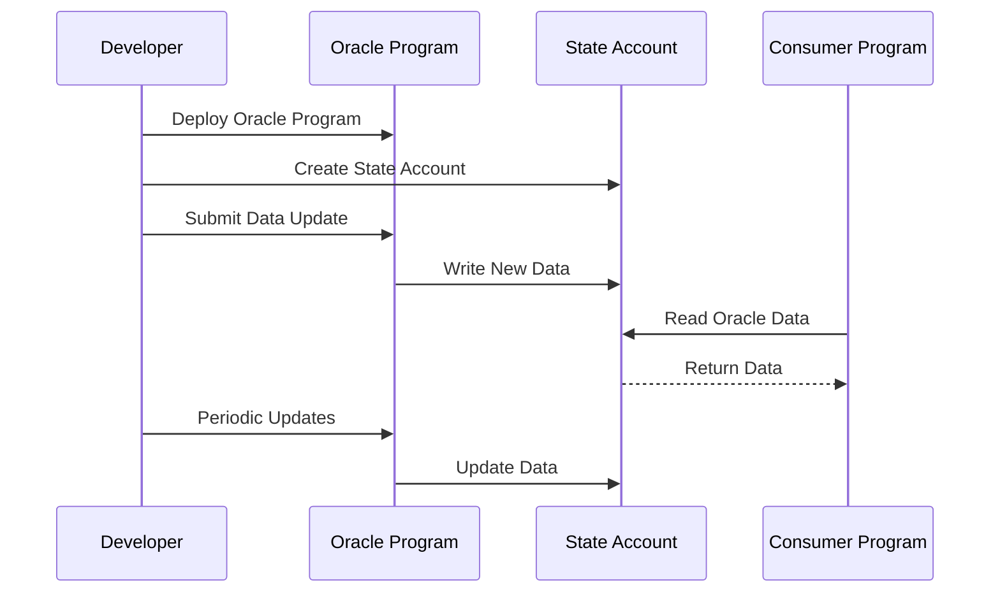

This guide walks through the inner workings of an oracle program as well as details how oracle data can be utilized by other programs on Arch Network.

## Table of Contents

- [Description](#description)
- [Flow](#flow)
- [Logic](#logic)
- [Implementation](#implementation)

## Description

Two important aspects of understanding how this oracle example is implemented within Arch:

1. **The oracle is a program that updates an account which holds the data**
2. **No cross-program invocation occurs** since only the account is updated and read from versus this being another program that gets interacted with from another program

The source code can be found within the [arch-examples](https://github.com/Arch-Network/arch-examples) repo.

## Flow



The oracle workflow follows these steps:

1. **Project deploys oracle program**
2. **Project creates state account** that the oracle program will control in order to write state to it
3. **Projects submit data to the oracle state account** by submitting instructions to the oracle program
4. **Programs include oracle state account** alongside their program instructions in order to use this referenced data stored in the oracle state account within their program
5. **Projects submit instructions to oracle program periodically** to update oracle state account with fresh data

## Logic

If you haven't already read [How to write an Arch program](/docs/guides/writing-your-first-program), we recommend starting there to get a basic understanding of the program anatomy before going further.

We'll look closely at the logic block contained within the `update_data` handler.

```rust
pub fn update_data(
    program_id: &Pubkey,
    accounts: &[AccountInfo],
    instruction_data: &[u8],
) -> Result<(), ProgramError> {
    let account_iter = &mut accounts.iter();
    let oracle_account = next_account_info(account_iter)?;

    assert!(oracle_account.is_signer);
    assert_eq!(instruction_data.len(), 8);

    // ... rest of implementation
}
```

First, we'll iterate over the accounts that get passed into the function, which includes the newly created state account that will be responsible for managing the oracle's data.

We then assert that the oracle state account has the appropriate authority to be written to and update what it stores within its data field. Additionally, we assert that the data we wish to update the account with is at least a certain number of bytes.

```rust
let data_len = oracle_account.data.try_borrow().unwrap().len();
if instruction_data.len() > data_len {
    oracle_account.realloc(instruction_data.len(), true)?;
}
```

Next, we calculate the length of the new data that we are looking to store in the account and reallocate memory to the account if the new data is larger than the data currently existing within the account. This step is important for ensuring that there is no remaining, stale data stored in the account before adding new data to it.

```rust
oracle_account
    .data
    .try_borrow_mut()
    .unwrap()
    .copy_from_slice(instruction_data);

msg!("updated");

Ok(())
```

Lastly, we store the new data that is passed into the program via the instruction to the state account for management, thus marking the end of the oracle update process.

## Implementation

Let's look at an example implementation of this oracle program. This includes:

- [Create oracle project](#create-oracle-project)
- [Deploy program](#deploy-program)
- [Create a state account](#create-a-state-account)
- [Update the state account](#update-the-state-account)
- [Read from the state account](#read-from-the-state-account)

### Create Oracle Project

First, we'll need to create a new project to hold our oracle logic.

```bash
# Create a new directory for your oracle project
mkdir oracle
cd oracle

# Initialize a Rust project
cargo init --lib
```

:::note
The new CLI does not currently have a project creation command. We'll manually set up our project structure.
:::

You'll need to create and edit the following files:
- `Cargo.toml` - Add dependencies for your oracle program
- `src/lib.rs` - Implement the oracle program logic

Example program files can be found in the [arch-examples](https://github.com/Arch-Network/arch-examples) repo.

#### Cargo.toml

```toml
[package]
name = "oracle"
version = "0.1.0"
edition = "2021"

[dependencies]
arch-program = "0.1.0"
borsh = "1.0"
```

#### src/lib.rs

```rust
use arch_program::{
    account::AccountInfo,
    entrypoint,
    msg,
    program_error::ProgramError,
    pubkey::Pubkey,
    borsh::{BorshDeserialize, BorshSerialize},
};

// Define the program's entry point
entrypoint!(process_instruction);

pub fn process_instruction(
    program_id: &Pubkey,
    accounts: &[AccountInfo],
    instruction_data: &[u8],
) -> Result<(), ProgramError> {
    // Parse the instruction data
    let instruction = OracleInstruction::try_from_slice(instruction_data)?;
    
    match instruction {
        OracleInstruction::UpdateData { data } => {
            update_data(program_id, accounts, &data)
        }
    }
}

#[derive(BorshSerialize, BorshDeserialize)]
pub enum OracleInstruction {
    UpdateData { data: Vec<u8> },
}

pub fn update_data(
    program_id: &Pubkey,
    accounts: &[AccountInfo],
    instruction_data: &[u8],
) -> Result<(), ProgramError> {
    let account_iter = &mut accounts.iter();
    let oracle_account = next_account_info(account_iter)?;

    // Verify the account is owned by this program
    if oracle_account.owner != program_id {
        return Err(ProgramError::IncorrectProgramId);
    }

    // Verify the account is a signer (has authority to update)
    if !oracle_account.is_signer {
        return Err(ProgramError::MissingRequiredSignature);
    }

    // Ensure we have data to store
    if instruction_data.is_empty() {
        return Err(ProgramError::InvalidInstructionData);
    }

    // Reallocate memory if needed
    let data_len = oracle_account.data.try_borrow().unwrap().len();
    if instruction_data.len() > data_len {
        oracle_account.realloc(instruction_data.len(), true)?;
    }

    // Update the account data
    oracle_account
        .data
        .try_borrow_mut()
        .unwrap()
        .copy_from_slice(instruction_data);

    msg!("Oracle data updated successfully");
    Ok(())
}
```

### Deploy Program

Once you have your oracle program written, you can deploy it to the Arch Network:

```bash
# Build the program
cargo build-bpf

# Deploy the program
arch-cli program deploy target/deploy/oracle.so
```

### Create a State Account

After deploying your oracle program, you need to create a state account that will hold the oracle data:

```bash
# Create a new account for storing oracle data
arch-cli account create \
  --keypair-path ~/oracle_state.key \
  --space 1024 \
  --owner <ORACLE_PROGRAM_ID> \
  --keypair-path ~/payer.key
```

### Update the State Account

Now you can update the oracle data by calling your program:

```bash
# Update oracle data with new information
arch-cli program call <ORACLE_PROGRAM_ID> \
  --accounts ~/oracle_state.key \
  --instruction-data <ENCODED_DATA> \
  --keypair-path ~/oracle_authority.key
```

### Read from the State Account

Other programs can read the oracle data by including the state account in their instruction:

```rust
// In your consumer program
pub fn process_instruction(
    program_id: &Pubkey,
    accounts: &[AccountInfo],
    instruction_data: &[u8],
) -> Result<(), ProgramError> {
    let account_iter = &mut accounts.iter();
    let oracle_account = next_account_info(account_iter)?;
    
    // Read the oracle data
    let oracle_data = oracle_account.data.try_borrow().unwrap();
    
    // Process the oracle data
    // ... your logic here
    
    Ok(())
}
```

## Advanced Oracle Patterns

### Price Oracle Example

Here's a more sophisticated example of a price oracle that stores structured data:

```rust
use arch_program::{
    account::AccountInfo,
    entrypoint,
    msg,
    program_error::ProgramError,
    pubkey::Pubkey,
    borsh::{BorshDeserialize, BorshSerialize},
};

#[derive(BorshSerialize, BorshDeserialize, Debug)]
pub struct PriceData {
    pub price: u64,           // Price in smallest unit (e.g., satoshis)
    pub decimals: u8,         // Number of decimal places
    pub timestamp: i64,       // Unix timestamp
    pub source: String,       // Data source identifier
}

#[derive(BorshSerialize, BorshDeserialize)]
pub enum PriceOracleInstruction {
    UpdatePrice { price_data: PriceData },
    GetPrice,
}

pub fn update_price(
    program_id: &Pubkey,
    accounts: &[AccountInfo],
    price_data: PriceData,
) -> Result<(), ProgramError> {
    let account_iter = &mut accounts.iter();
    let oracle_account = next_account_info(account_iter)?;

    // Verify ownership and authority
    if oracle_account.owner != program_id {
        return Err(ProgramError::IncorrectProgramId);
    }

    if !oracle_account.is_signer {
        return Err(ProgramError::MissingRequiredSignature);
    }

    // Serialize the price data
    let serialized_data = price_data.try_to_vec()
        .map_err(|_| ProgramError::InvalidInstructionData)?;

    // Reallocate if needed
    let current_len = oracle_account.data.try_borrow().unwrap().len();
    if serialized_data.len() > current_len {
        oracle_account.realloc(serialized_data.len(), true)?;
    }

    // Update the account data
    oracle_account
        .data
        .try_borrow_mut()
        .unwrap()
        .copy_from_slice(&serialized_data);

    msg!("Price updated: {} at {}", price_data.price, price_data.timestamp);
    Ok(())
}
```

### Multi-Source Oracle

For more robust oracles, you might want to aggregate data from multiple sources:

```rust
#[derive(BorshSerialize, BorshDeserialize, Debug)]
pub struct MultiSourcePrice {
    pub sources: Vec<PriceData>,
    pub aggregated_price: u64,
    pub confidence: u8,  // 0-100 confidence score
}

pub fn aggregate_prices(prices: Vec<PriceData>) -> MultiSourcePrice {
    if prices.is_empty() {
        return MultiSourcePrice {
            sources: vec![],
            aggregated_price: 0,
            confidence: 0,
        };
    }

    // Simple average for demonstration
    let total: u64 = prices.iter().map(|p| p.price).sum();
    let average_price = total / prices.len() as u64;
    
    // Calculate confidence based on price variance
    let variance = prices.iter()
        .map(|p| (p.price as i64 - average_price as i64).pow(2))
        .sum::<i64>() / prices.len() as i64;
    
    let confidence = (100 - (variance as u64 / 1000).min(100)) as u8;

    MultiSourcePrice {
        sources: prices,
        aggregated_price: average_price,
        confidence,
    }
}
```

## Security Considerations

### Access Control

```rust
pub fn verify_oracle_authority(
    oracle_account: &AccountInfo,
    expected_authority: &Pubkey,
) -> Result<(), ProgramError> {
    // Check if the account is owned by the oracle program
    if oracle_account.owner != &ORACLE_PROGRAM_ID {
        return Err(ProgramError::IncorrectProgramId);
    }

    // Verify the authority
    if oracle_account.key != expected_authority {
        return Err(ProgramError::InvalidAccountData);
    }

    // Ensure the account is a signer
    if !oracle_account.is_signer {
        return Err(ProgramError::MissingRequiredSignature);
    }

    Ok(())
}
```

### Data Validation

```rust
pub fn validate_price_data(price_data: &PriceData) -> Result<(), ProgramError> {
    // Check for reasonable price range
    if price_data.price == 0 {
        return Err(ProgramError::InvalidInstructionData);
    }

    // Check timestamp is recent (within last hour)
    let current_time = arch_program::clock::Clock::get()?.unix_timestamp;
    if current_time - price_data.timestamp > 3600 {
        return Err(ProgramError::InvalidInstructionData);
    }

    // Validate decimals
    if price_data.decimals > 18 {
        return Err(ProgramError::InvalidInstructionData);
    }

    Ok(())
}
```

## Testing Your Oracle

### Unit Tests

```rust
#[cfg(test)]
mod tests {
    use super::*;
    use arch_program::test_utils::*;

    #[test]
    fn test_price_update() {
        let program_id = Pubkey::new_unique();
        let oracle_account = create_test_account(&program_id, 1024);
        
        let price_data = PriceData {
            price: 50000,
            decimals: 8,
            timestamp: 1640995200,
            source: "coinbase".to_string(),
        };

        let result = update_price(
            &program_id,
            &[oracle_account],
            price_data,
        );

        assert!(result.is_ok());
    }
}
```

### Integration Tests

```bash
# Test oracle update
arch-cli program call <ORACLE_PROGRAM_ID> \
  --accounts ~/oracle_state.key \
  --instruction-data $(echo '{"price": 50000, "decimals": 8, "timestamp": 1640995200, "source": "coinbase"}' | base64) \
  --keypair-path ~/oracle_authority.key

# Verify the update
arch-cli account show ~/oracle_state.key
```

## Best Practices

### 1. Data Freshness

- Implement timestamp validation to ensure data is recent
- Set appropriate expiration times for oracle data
- Consider implementing staleness penalties

### 2. Source Diversity

- Aggregate data from multiple sources when possible
- Implement confidence scoring based on source agreement
- Weight sources based on their historical accuracy

### 3. Security

- Use proper access controls for oracle updates
- Implement rate limiting to prevent spam updates
- Consider using multisig for critical oracle operations

### 4. Efficiency

- Optimize data structures for minimal storage costs
- Use appropriate data types to reduce serialization overhead
- Consider compression for large datasets

## Next Steps

<Cards>
  <Card title="Runes Swap Guide" href="/docs/guides/how-to-build-runes-swap">
    Learn to build a token swap protocol
  </Card>
  <Card title="Lending Protocol" href="/docs/guides/how-to-build-lending-protocol">
    Create a lending protocol using oracles
  </Card>
  <Card title="Program Development" href="/docs/guides/writing-your-first-program">
    Master Arch program development
  </Card>
  <Card title="Arch Examples" href="https://github.com/Arch-Network/arch-examples" external>
    Explore more example programs
  </Card>
</Cards>

## Resources

<Cards>
  <Card title="Arch Examples Repository" href="https://github.com/Arch-Network/arch-examples" external>
    Complete oracle implementation examples
  </Card>
  <Card title="Program Development Guide" href="/docs/guides/writing-your-first-program">
    Learn the basics of Arch program development
  </Card>
  <Card title="Account Management" href="/docs/program/accounts">
    Understand account management in Arch programs
  </Card>
  <Card title="Community Discord" href="https://discord.gg/archnetwork" external>
    Get help from the community
  </Card>
</Cards>
