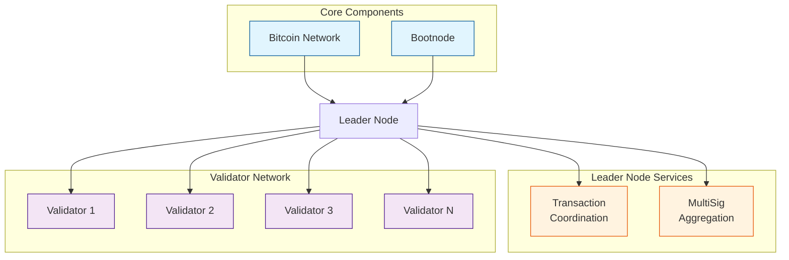
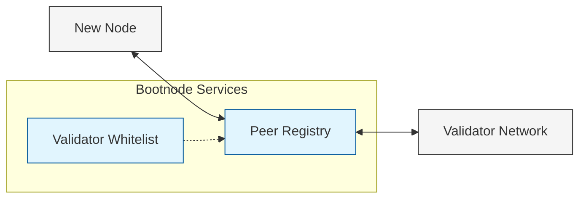
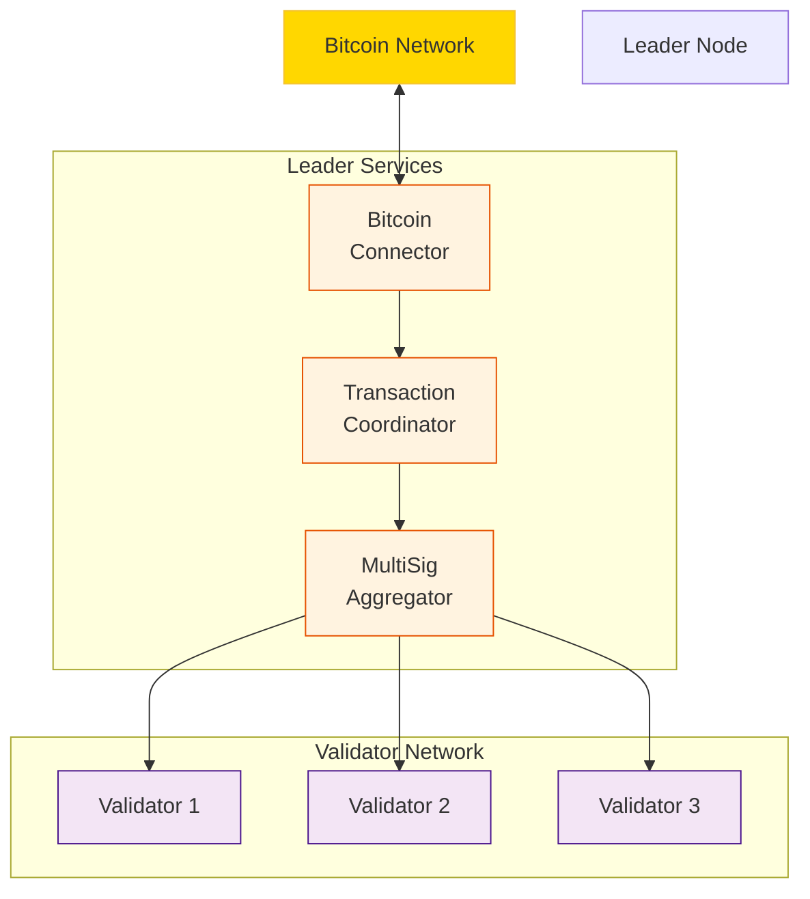
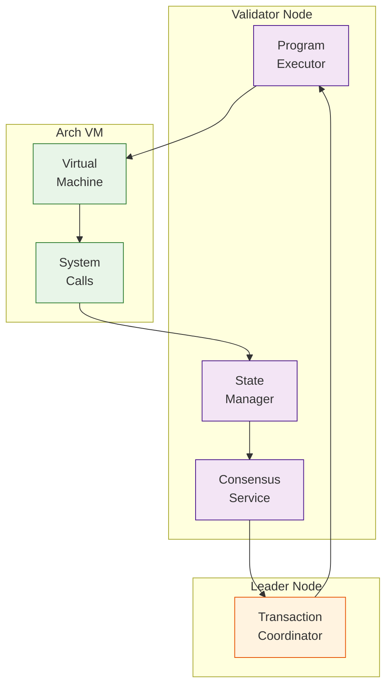
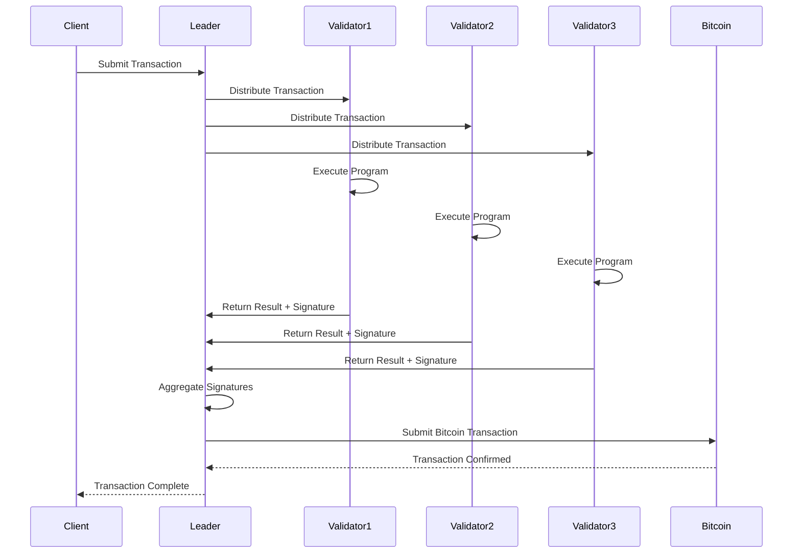
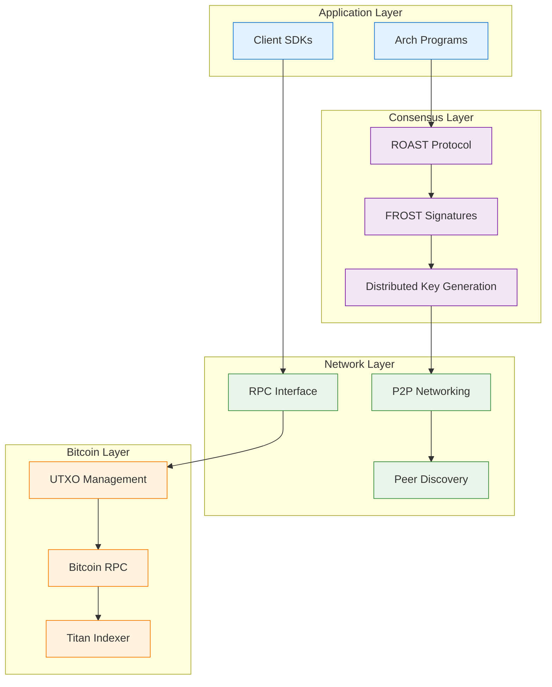
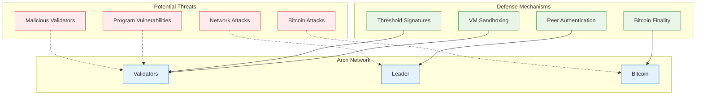

Arch Network operates as a distributed system with different types of nodes working together to provide secure and efficient program execution on Bitcoin. This document details the network's architecture and how different components interact.

## Network Overview



## Node Types

### 1. Bootnode

The bootnode serves as the network's entry point, similar to DNS seeds in Bitcoin:
- Handles initial network discovery
- Maintains whitelist of valid validators
- Coordinates peer connections
- Manages network topology



Configuration:
```bash
cargo run -p bootnode -- \
    --network-mode localnet \
    --p2p-bind-port 19001 \
    --leader-peer-id "<LEADER_ID>" \
    --validator-whitelist "<VALIDATOR_IDS>"
```

### 2. Leader Node

The leader node coordinates transaction processing and Bitcoin integration:



Key responsibilities:
- **Transaction Coordination**: Manages transaction flow and validation
- **MultiSig Aggregation**: Collects and aggregates threshold signatures
- **Bitcoin Integration**: Handles Bitcoin RPC communication
- **Network Management**: Coordinates with validators and bootnode

### 3. Validator Nodes

Validator nodes execute programs and participate in consensus:



Validator responsibilities:
- **Program Execution**: Run smart contracts in the Arch VM
- **State Management**: Maintain program and account state
- **Consensus Participation**: Contribute to threshold signatures
- **Transaction Validation**: Verify transaction integrity

## Network Communication

### Message Flow



### Protocol Stack



## Security Model

### Multi-Layer Security

Arch Network implements security at multiple layers:

1. **Bitcoin Security**: Leverages Bitcoin's proven security guarantees
2. **Threshold Signatures**: No single validator can compromise the system
3. **Network Security**: Authenticated peer-to-peer communication
4. **Program Security**: Sandboxed execution environment

### Threat Model



## Performance Characteristics

### Scalability

- **Horizontal Scaling**: Add more validators for increased throughput
- **Parallel Processing**: Multiple transactions processed simultaneously
- **Efficient State Management**: Optimized data structures for fast access
- **Network Optimization**: Efficient peer-to-peer communication

### Throughput

- **High TPS**: Optimized for high transaction throughput
- **Low Latency**: Fast transaction confirmation
- **Batch Processing**: Efficient handling of multiple operations
- **Resource Management**: Compute budget optimization

### Reliability

- **Fault Tolerance**: Continues operation despite node failures
- **Recovery**: Automatic recovery from network partitions
- **Audit Trail**: Complete transaction history and state changes
- **Monitoring**: Real-time performance and health monitoring

## Network Configuration

### Development Network

```bash
# Start local development network
arch-cli orchestrate start

# Services:
# - Bitcoin Core: http://127.0.0.1:18443
# - Titan API: http://127.0.0.1:8080
# - Validator RPC: http://127.0.0.1:9002
```

### Testnet Configuration

```bash
# Configure for testnet
arch-cli config create-profile testnet \
    --bitcoin-node-endpoint http://bitcoin-rpc.test.arch.network:80 \
    --bitcoin-network testnet \
    --arch-node-url http://localhost:9002
```

### Production Network

Production network configuration will be available when mainnet launches.

## Monitoring and Telemetry

### Health Checks

```bash
# Check validator health
curl http://localhost:9002/health

# Check Bitcoin connection
bitcoin-cli -regtest getblockchaininfo

# Check Titan status
curl http://localhost:8080/health
```

### Metrics

Key metrics to monitor:
- **Transaction Throughput**: Transactions per second
- **Block Production**: Block generation rate
- **Network Latency**: Message propagation time
- **Validator Participation**: Active validator count
- **Bitcoin Sync**: Bitcoin blockchain synchronization status

## Network Maintenance

### Validator Management

- **Adding Validators**: Update whitelist and restart network
- **Removing Validators**: Graceful removal with state migration
- **Validator Updates**: Rolling updates with minimal downtime
- **Key Rotation**: Regular DKG sessions for security

### Network Upgrades

- **Protocol Upgrades**: Coordinated network-wide updates
- **Feature Rollouts**: Gradual feature deployment
- **Backward Compatibility**: Maintain compatibility with older versions
- **Emergency Procedures**: Rapid response to critical issues

## Next Steps

<Cards>
  <Card title="Bitcoin Integration" href="/docs/Core-Concepts/bitcoin-integration">
    Learn how Arch integrates with Bitcoin
  </Card>
  <Card title="Consensus Mechanism" href="/docs/Core-Concepts/consensus">
    Understand ROAST and FROST consensus
  </Card>
  <Card title="Validator Setup" href="/docs/Setup-Infrastructure/bitcoin-and-titan-setup">
    Set up your own validator node
  </Card>
  <Card title="Program Development" href="/docs/development/writing-your-first-program">
    Start building Arch programs
  </Card>
</Cards>
